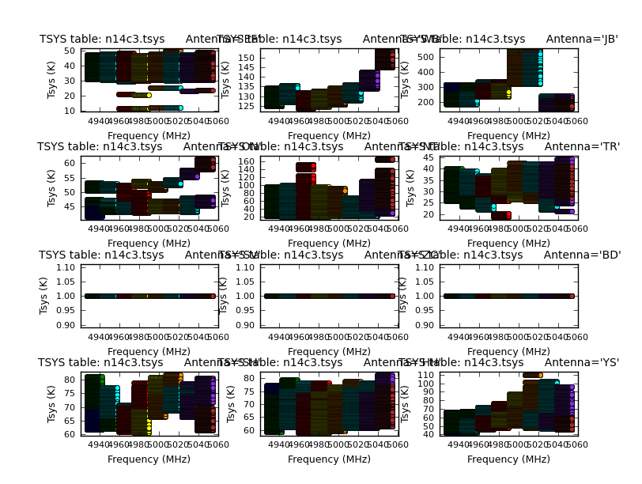
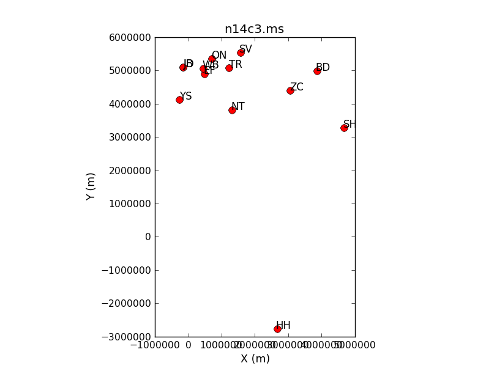

# Part 1: CASA Basic EVN Calibration

##### [<< Return to homepage](../../../index.md)
##### [<< Return to EVN continuum](../overview_page.md)

### <a name="top">Guidance for calibrating EVN data using CASA</a>

This guide uses capabilities of CASA 4.7.2; CASA 5+ does work apart from the Tsys calibration step (and the script isn't fixed yet, see Issue #1).

It is suitable for good-quality EVN data which does not require the use of 'rate' in calibration. It also requires a prepared gaincurve table and helper scripts if you are starting from the fitsidi data. You need about 20 G disk space, although one could manage with less by moving early versions of these files to storage.


1. [Data and supporting material](#Data_and_supporting_material)
2. [How to use this guide](#How_to_use_this_guide)
3. [Data loading and inspection](#Data_loading_and_inspection)
  * [Load data and correct for Earth rotation](#Load_data_earth_rot)
  * [Fix antenna and Tsys tables](#Fix_antenna_tsys)
  * [Inspect and flag data](#Flag_auto_inspect)
4. Frequency-related calibration
  * Delay calibration</li>
  * Pre-bandpass time-dependent phase correction</li>
  * Bandpass correction
5. Apply calibration and split out phase-ref - target pairs
6. Apply the initial calibration
7. Split out each pair of sources

### 1. <a name="Data_and_supporting_material">Data and supporting material</a>
[<< back to top](#top)

n14c3 is an EVN network monitoring experiment. It contains two target - phase-reference pairs of bright sources (plus a 5th source which we will not use). The full data reduction here needs:

* Raw data (fits IDI files from the JIVE correlator)
  - n14c3_1_1.IDI1,
  - n14c3_1_1.IDI2
* Gain curve and Tsys tables (specially prepared for this data set by Mark Kettenis and Anita Richards)
  - n14c3.gc
  - n14c3.antab
* Helper scripts by Mark Kettenis to convert the .antab Tsys table to the correct format
  - key.py
  - tsys_spectrum.py
* Flag command files. You can write these yourself but to save time you can use some or all of these
  - flagSH.flagcmd
  - flagSH1.flagcmd
  - flagTar1Ph1.flagcmd

These are all provided on your desktop for the DARA workshops, but the fits IDI files can also be obtained from [here](http://www.jive.nl/fitsfiles?experiment=N14C3_141022) along with more information about the observations. The other files are available [here](http://www.jb.man.ac.uk/~radcliff/DARA/Data_reduction_workshops/EVN_Continuum/NME_DARA.tgz)

* List of data reduction scripts and intermediate data products for each part
  - Part1: Initial data inspection and calibration common to all sources: files listed above. Optional NME_all.py is a script version of the commands, for your future reference.
  - Part2: Further calibration and imaging of 1848+283/J1849+3024.
    * 1848+283_J1849+3024.ms you made at the end of the initial calibration (end of part 1)
    * or, 1848+283_J1849+3024.ms.tgz (ready made)
    * NME_J1849.py
  - Part3: Further calibration and imaging of J1640+3946/3C345.
    * J1640+3946_3C345.ms you made at the end of the initial calibration (end of Part 1)
    * or, J1640+3946_3C345.ms.tgz (ready made);
    * NME_3C345_skeleton.py
    * (NME_3C345.py.gz is complete script for future reference)

These are the sources:

| Number | Name | Position (J2000) | Role |
| :----: | :----: | :----: | :----: |
|0 | J1640+3946  | 16:40:29.632770 +39.46.46.02836 | target |
|1 | 3C345 | 16:42:58.809965 +39.48.36.99402 | phase-cal |
|2  |  J1849+3024  |  18:49:20.103406 +30.24.14.23712 | target |
|3 |    1848+283 |   18:50:27.589825 +28.25.13.15523 |phase-cal |
| 4 | 2023+336  | 20:25:10.842114 +33.43.00.21435 |not used |

J1849+3024 is also used as bandpass calibrator because it is a bright, compact source with good data on all baselines. If you are reducing a new data set, you would check the suitability of the bandpass calibrator during early data reduction.

### 2. <a name="How_to_use_this_guide">How to use this guide</a>
[<< back to top](#top)

This web page presents inputs for CASA tasks to be entered interactively at a terminal prompt for the calibration of the averaged data and initial target imaging. This is useful to examine your options and see how to check for syntax errors.

* To begin with, work interactively to see what each parameter is for. This is used for the initial steps and calibration common to all sources.
* Calibrate and image one phase-reference and target using a script (`NME_J1849.py`).
* Use this information to enter parameters and values in `NME_3C345_skeleton.py` for the other phase-ref - target pair.

**To start:**

1. Make a directory called something you will remember, e.g. EVN, and work in it. (Do not do data reduction within the CASA installation).
2. Copy the data and files you need to this directory. <path\*\*\*> is the original location of these files; **Note** in general, *** means something for you to fill in. e.g:

```bash
mdir EVN
cd EVN
cp <path***>/n14c3_1_1.IDI? .
cp <path***>/NME_DARA.tgz .
cp <path***>/*py .

tar -zxvf NME_DARA.tgz          # extract the additional material (also the scripts  which will be supplied).
```

### 3. <a name="Data_loading_and_inspection">Data loading and inspection</a>
[<< back to top](#top)

* Check that you are in the right place with all the data.

```bash
pwd                   # tells you present working directory
ls
which should show

flagSH1.flagcmd      key.py          n14c3.antab        NME_3C345_skeleton.py  NME_J1849.py
flagSH.flagcmd       n14c3_1_1.IDI1  n14c3.gc           NME_all.py             tsys_spectrum.py
flagTar1Ph1.flagcmd  n14c3_1_1.IDI2  NME_3C345.py       NME_DARA.tgz
```

* Now start CASA.

#### <a name="Load_data_earth_rot">a. Load data and correct for Earth rotation
[<< back to top](#top)

* The first task is `importfitsidi` which converts the fits files to CASA-amicable Measurement Sets (MS). Copy these lines one at a time (when you get more familiar, some inputs can be copied together).

```python
# in CASA
os.system('rm -rf n14c3_prefix.ms*')              # make sure no old files are present

default(importfitsidi)                            # initialise task
inp()                                             # list all inputs

fitsidifile=['n14c3_1_1.IDI1','n14c3_1_1.IDI2']   # fits files to convert
vis='n14c3_prefix.ms'                            # output ms file name
constobsid=True                                   # data could be processed together
scanreindexgap_s=15                               # only separate scans if gap >15 sec (or source change)
inp()                                             # check your inputs

importfitsidi()                                   # if happy, execute the task
```

`inp()` provide checks that you should normally carry out but the script won't repeat these for every task.

**Note** A few warnings about DIAMETER and POLCALA/B and zero/negative scan Nos may appear because CASA is not yet fully adapted for VLBI data but normally can be ignored if the task finishes ok. Check you CASA logger just in case.

**Important** You can review the inputs to the last time you ran a task by typing:

```python
# In CASA:
ls      # This should show the MS you just created and importfitsidi.last

!more importfitsidi.last   # ! allows you to run any linux shell command
This will show something like:

taskname           = 'importfitsidi'
fitsidifile        =  ['n14c3_1_1.IDI1', 'n14c3_1_1.IDI2']
vis                =  'n14c3__prefix.ms'
constobsid         =  True
scanreindexgap_s    =  15
#importfitsidi(fitsidifile=['n14c3_1_1.IDI1', 'n14c3_1_1.IDI2'],vis="n14c3__prefix.ms",constobsid=True,scanreindexgap_s=15)
```

The first format is for the interactive input (i.e. what you type directly into CASA), and the second format (without '#') is for use when scripting (automatic calibration! woo!).

* Now adjust the uvw coordinates to allow for the projection effect as the Earth rotates.

```python
# In CASA:
os.system('rm -rf n14c3.ms')
os.system('rm -rf n14c3.ms.flagversions')

default(fixvis)
vis='n14c3_prefix.ms'
outputvis='n14c3.ms'

fixvis()
```

* List the contents of the measurement set (creates a new file called `n14c3.ms.listobs` in your current directory)

```python
# In CASA:
os.system('rm -rf n14c3.ms.listobs')

default(listobs)
vis='n14c3.ms'
listfile='n14c3.ms.listobs'
listobs()
```
* Inspect this listing in `gedit` i.e. type in CASA `!gedit n14c3.ms.listobs` or use a text viewer of your choice.

**Important** The listobs output give information on what is contained in your data set i.e. antennas, sources, scans etc. The following section breaks this file down:

  * Scan listing: this shows the pattern of observations. Each scan is about 1 min and each individual integration about 2 sec.
```
 Date        Timerange (UTC)          Scan    FldId FieldName              nRows     SpwIds              Average Interval(s)    ScanIntent
  22-Oct-2014/12:00:00.0 - 12:04:00.0     1      1 3C345                    52800  [0,1,2,3,4,5,6,7]  [2, 2, 2, 2, 2, 2, 2, 2]
              12:06:00.0 - 12:10:00.0     2      1 3C345                    63360  [0,1,2,3,4,5,6,7]  [2, 2, 2, 2, 2, 2, 2, 2]
              12:12:00.0 - 12:13:00.0     3      1 3C345                    15840  [0,1,2,3,4,5,6,7]  [2, 2, 2, 2, 2, 2, 2, 2]
              12:13:40.0 - 12:14:40.0     4      1 3C345                    15840  [0,1,2,3,4,5,6,7]  [2, 2, 2, 2, 2, 2, 2, 2]
              12:15:20.0 - 12:16:20.0     5      0 J1640+3946               15840  [0,1,2,3,4,5,6,7]  [2, 2, 2, 2, 2, 2, 2, 2]
              12:17:00.0 - 12:18:00.0     6      1 3C345                    13200  [0,1,2,3,4,5,6,7]  [2, 2, 2, 2, 2, 2, 2, 2]
              12:18:40.0 - 12:19:40.0     7      0 J1640+3946               13200  [0,1,2,3,4,5,6,7]  [2, 2, 2, 2, 2, 2, 2, 2]
...
```
  * Names and positions of fields observed.
```
Fields: 5
  ID   Code Name                RA               Decl           Epoch        nRows
  0         J1640+3946          16:40:29.632770 +39.46.46.02836 J2000       254400
  1         3C345               16:42:58.809965 +39.48.36.99402 J2000       383520
  2         J1849+3024          18:49:20.103406 +30.24.14.23712 J2000       276480
  3         1848+283            18:50:27.589825 +28.25.13.15523 J2000       388800
  4         2023+336            20:25:10.842114 +33.43.00.21435 J2000       542880
```

  * Correlator set-up: there are 8 spectral windows (AKA IFs), each of 32 channels, and 4 polarization products (we will only use the total intensity combination of RR and LL).
```
Spectral Windows:  (8 unique spectral windows and 1 unique polarization setups)
  SpwID  Name   #Chans   Frame   Ch0(MHz)  ChanWid(kHz)  TotBW(kHz) CtrFreq(MHz)  Corrs          
  0      none      32   TOPO    4926.990       500.000     16000.0   4934.7400   RR  RL  LR  LL
  1      none      32   TOPO    4942.490       500.000     16000.0   4950.2400   RR  RL  LR  LL
  2      none      32   TOPO    4958.990       500.000     16000.0   4966.7400   RR  RL  LR  LL
  3      none      32   TOPO    4974.490       500.000     16000.0   4982.2400   RR  RL  LR  LL
  4      none      32   TOPO    4990.990       500.000     16000.0   4998.7400   RR  RL  LR  LL
  5      none      32   TOPO    5006.490       500.000     16000.0   5014.2400   RR  RL  LR  LL
  6      none      32   TOPO    5022.990       500.000     16000.0   5030.7400   RR  RL  LR  LL
  7      none      32   TOPO    5038.490       500.000     16000.0   5046.2400   RR  RL  LR  LL
```
  * Antennas used. The Offset from array center is zero since the absolute Earth-centred coordinates are given for each antenna.
```
Antennas: 12:
  ID   Name  Station   Diam.    Long.         Lat.                Offset from array center (m)                ITRF Geocentric coordinates (m)        
                                                                     East         North     Elevation               x               y               z
  0    EF    EVN:01    0.0  m   +006.53.01.0  +50.20.09.1          0.0000        0.0000  6365855.3595  4033947.234200   486990.818800  4900431.012900
  1    WB    EVN:02    0.0  m   +006.38.00.0  +52.43.48.0          0.0000        0.0000  6364640.6582  3828445.418100   445223.903400  5064921.723400
  2    JB    EVN:03    0.0  m   -002.18.30.9  +53.03.06.6         -0.0000        0.0000  6364633.4245  3822625.831700  -154105.346600  5086486.205800
  3    ON    EVN:04    0.0  m   +011.55.04.0  +57.13.05.3          0.0000        0.0000  6363057.6347  3370965.885800   711466.227900  5349664.219900
...
```


#### <a name="Fix_antenna_tsys">b. Fix antenna and Tsys tables </a>

These steps may not always be needed as CASA and EVN data formats become more compatible especially with the VLBI tools getting released with CASA v5.3+.

The `antab` table has to be converted into a subtable within the MS using `tsys_spectrum.py`. This is then be used to generated a Tsys correction table using `gencal`. The system temperature is measured every few minutes. This compensates roughly for the different levels of signal from different sources, the effects of elevation and other amplitude fluctuations. Each antenna has a characteristic response in terms of Kelvin of system temperature per Jy of flux, so Tsys is also used to scale the flux density.

```python
# In CASA:
inbase='n14c3'                   # pass base name to script
execfile('tsys_spectrum.py')     # execfile runs any suitable script inside CASA

os.system('rm -rf n14c3.tsys')

default(gencal)  # This reads the Tsys information we just wrote into the MS and derives a calibration table
vis='n14c3.ms'
caltable='n14c3.tsys'
caltype='tsys'

gencal()
```

Plot the table generated.

```python
# In CASA:
default(plotcal)
caltable='n14c3.tsys'
xaxis='freq'
yaxis='tsys'
subplot=431
iteration='antenna'
plotcal()
```



You can see the changes with each source change.

Three antennas do not have Tsys measurements but the .gc (gain curve) table provides a scaled gain-elevation correction which scales the visibility amplitudes, although without any allowance for weather or source contribution

`listobs` gave the antenna diameters as zero since the information is not written into the fits files for EVN data. Some antennas have off-axis feeds and so the offsets also have to be inserted.

```python
# In CASA
# Copy these arrays of values (no line breaks in each array)
ants=  ['EF','WB','JB','ON','NT','TR','SV','ZC','BD','SH','HH','YS','JD']
diams= [100.0,300.0,75.0,25.0,32.0,32.0,32.0,32.0,32.0,25.0,24.0,40.0,25.0]
axoffs=[[0.013,4.95,0.,2.15,1.831,0.,-0.007,-0.008,-0.004,-0.002,6.692,2.005,0.]
        ,[0.,0.,0.,0.,0.,0.,0.,0.,0.,0.,0.,0.,0.]
        ,[0.,0.,0.,0.,0.,0.,0.,0.,0.,0.,0.,0.,0.]]

# Modify the antenna table
tb.open('n14c3.ms/ANTENNA', nomodify=F)
tb.putcol('DISH_DIAMETER', diams)
tb.putcol('OFFSET',axoffs)
tb.close()

default(listobs)     # Check in listobs
vis='n14c3.ms'
listobs()
```

This time we don't write a text file because the parameter `listfile` was not set, so just look in the logger to ensure that the antenna diameters now appear.

#### <a name="Flag_auto_inspect">c. Inspect and flag data </a>

* Lets first flag the autocorrelations for continuum data (ignore warnings about the processor).

```python
# In CASA
default(flagdata)
vis='n14c3.ms'
mode='manual'
autocorr=T

flagdata()
```

* Next lets plot the location of antennas using task `plotants`.

```python
# In CASA
default(plotants)
vis='n14c3.ms'

plotants()
```

