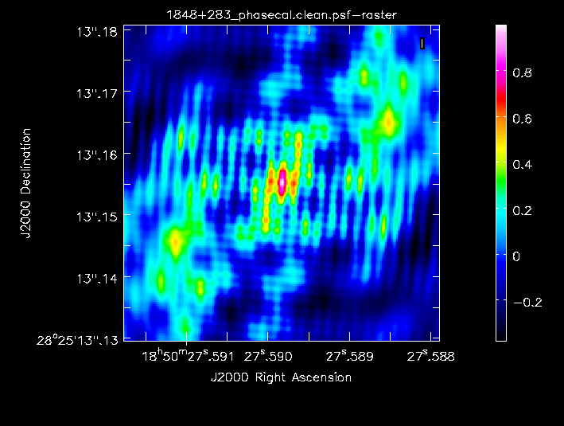
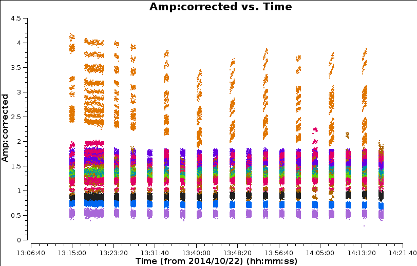
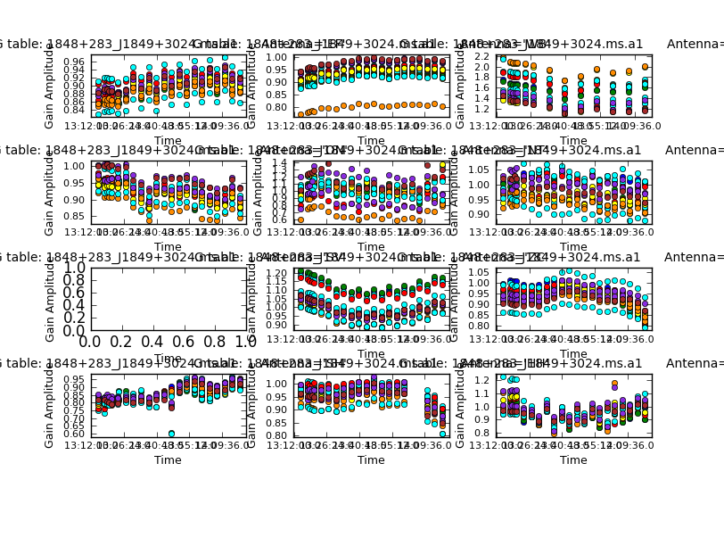
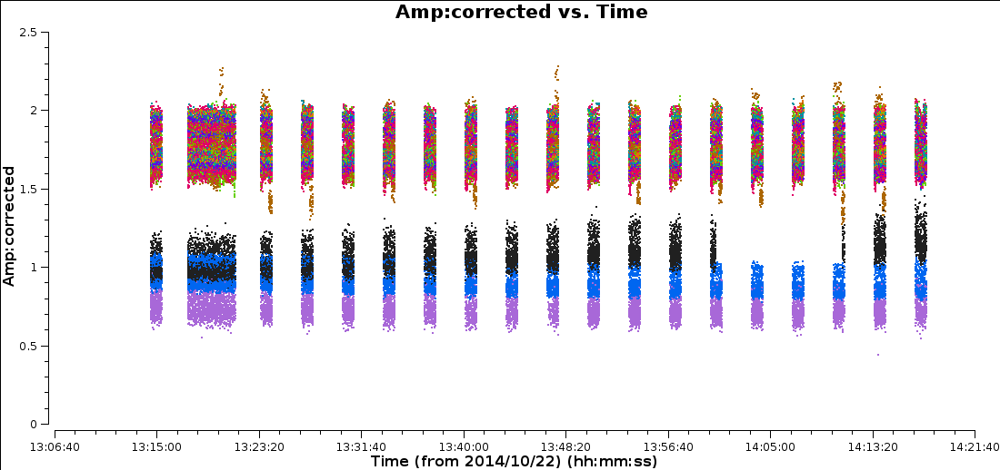
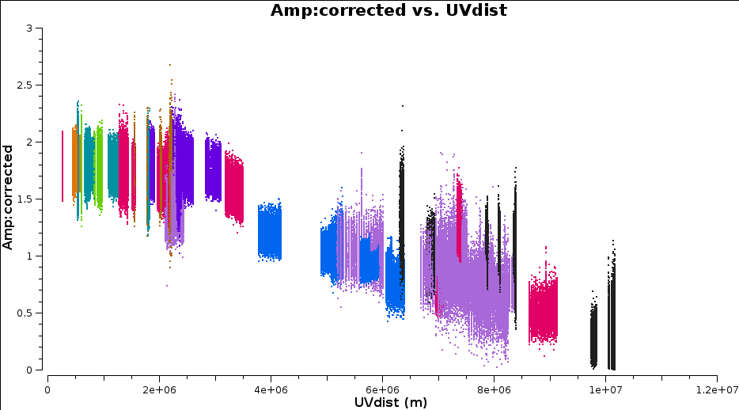
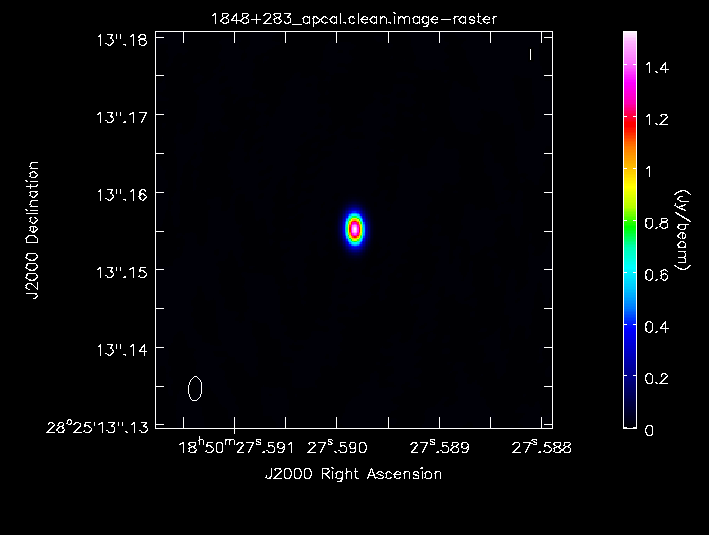

## Part2: Calibration and imaging of J1849+3024
##### [<< Return to homepage](../../../index.md)
##### [<< Return to EVN continuum](../overview_page.md)

This page expects that you have completed [part 1](../part1/part1_initial_cal.md) to get as far as applying the Tsys/gain curve, initial delay and bandpass corrections to all sources and split out 1848+283_J1849+3024.ms (and also to become familiar with the basics of CASA).

A new MS contains just a 'data' column. The previous `applycal` made a copy of the data with calibration applied, writing a 'corrected' column into the MS and split then took just that column and wrote new data sets, where this becomes a 'data' column.

If you don't have a good version of 1848+283_J1849+3024.ms (remove any bad versions), get [1848+283_J1849+3024.ms.tgz](http://www.jb.man.ac.uk/~radcliff/DARA/Data_reduction_workshops/EVN_Continuum/1848+283_J1849+3024.ms.tgz) and extract it using `tar -zxvf 1848+283_J1849+3024.ms.tgz`.

To summarise you will need for this part:
* 1848+283_J1849+3024.ms you made at the end of the initial calibration (end of part 1)
* or, 1848+283_J1849+3024.ms.tgz (ready made)
* NME_J1849.py **included in [NME_DARA.tgz](http://www.jb.man.ac.uk/~radcliff/DARA/Data_reduction_workshops/EVN_Continuum/NME_DARA.tgz) from part1**

1848+283_J1849+3024.ms contains phase-ref 1848+283 and target J1849+3024. You should have 1848+283_J1849+3024.ms.listobs made at the end of CASA_Basic_EVN which shows the interleaving of the target and phase-ref.

```
13:23:20.0 - 13:24:20.0    38      1 1848+283                 18720  [0,1,2,3,4,5,6,7]  [2, 2, 2, 2, 2, 2, 2, 2]
13:25:00.0 - 13:26:00.0    39      0 J1849+3024               18720  [0,1,2,3,4,5,6,7]  [2, 2, 2, 2, 2, 2, 2, 2]
13:26:40.0 - 13:27:40.0    40      1 1848+283                 18720  [0,1,2,3,4,5,6,7]  [2, 2, 2, 2, 2, 2, 2, 2]
13:28:20.0 - 13:29:20.0    41      0 J1849+3024               15840  [0,1,2,3,4,5,6,7]  [2, 2, 2, 2, 2, 2, 2, 2]
13:30:00.0 - 13:31:00.0    42      1 1848+283                 15840  [0,1,2,3,4,5,6,7]  [2, 2, 2, 2, 2, 2, 2, 2]
...
```
Before we start:
* Look at the script in a text editor (e.g. `gedit`).

**Important:** Each step contains one or a few tasks which perform a step in calibration or imaging. It is not completely automatic because it expects interactive imaging, and you need to inspect some of the plots to check and/or to make decisions. The source names and some other parameters are set as variables so the script could be used as a template for other similar data reduction. The `taskname(parameter=value)` way of running a task automatically sets all unspecified parameters to default. Use `inp` task or `help` task at the CASA prompt to check before running a task.

The following calibration script will go through the following (note that the steps correspond to the `NME_J1849.py` script):

1. [Initial inspection of data (step 1)](#Initial_inspection)
2. [Calibration using the phase-reference source](#Phase_reference_cal)
  * [Time-dependent delay and phase calibration (step 2)](#Time_dep_delay)
3. [Apply phase solutions and image phase-ref (step 3)](#apply_sol_first_image)
  * [Check for remaining bad data (step 4)](#Bad_data_remain)
  * [Time-dependent amplitude calibration (step 5)](#Time_dep_amp_cal)
  * [Apply amplitude and phase solutions to the phase-ref (step 6)](#Apply_time_dep_amp_cal)
  * [Clean the calibrated phase-ref (step 7)](#Clean_cal_phase_ref)
  * Uncalibrated target image (step 8)
  * Apply all calibration to the target (step 9)
4. Imaging and self-calibration of the target
  * Split out target 2 and image (step 10)
  * Self-calibrate target phase only and apply (step 11)
  * Image phase-self-calibrated target (step 12)
  * Self-calibrate target amplitude and phase and apply (step 13)
  * Image the amplitude and phase self-calibrated target (step 14)

### 1. <a name="Initial_inspection">Initial inspection of data (step 1)</a>

```python
# In CASA

mysteps=[1]
execfile('NME_J1849.py')
```

Page through the plots. The phase-ref is in red, target in black. The phase offsets for both sources follow a similar pattern per baseline and correlation, so the phase-reference solutions should also correct the target OK. Note that JB misses every other pair of scans.


### 2. <a name="Phase_reference_cal">Calibration using the phase-reference source</a>
#### a. <a name="Time_dep_delay">Time-dependent delay and phase calibration (step 2)

* First, we solve for residual delay errors for each scan on the phase-ref.


* Set `mysteps=[2]` and repeat as above and look at the plot of the solutions.

Normally, the bandpass and phase calibrators are different sources; since in this case they are the same, the corrections are very small.

* This step also solves for phase as a function of time, averaging all channels (with the new delay corrections applied).

There are a number of considerations in choosing the solution interval. Here, the phase errors do not change massively in a minute, but the S/N is high. So using 30s, half the scan length, means that all the data will be used in interpolating over the target.


Each colour is a different spw. The phase corrections change more rapidly with time for the antennas on the longest baselines but if you zoom in you can see that the solutions are coherent, not just noise.

### 2. <a name="apply_sol_first_image">Apply phase solutions and image phase-ref (step 3)</a>
In VLBI, even calibration sources are often resolved (i.e. the source is not a single blob which is the size of the resolution of your array), and so by making an image is also a useful check.

In `mystep=[3]` we will:

* First, the delay and phase corrections are applied to the MS to make a corrected column using `applycal`.
* An initial image of the phase calibrator using the task `clean` is made to see whether the calibrator is resolved.

The task `clean` (which always used the corrected data column if it is present) is used for imaging. THe following notes try to decompose the steps `clean` takes to make you beautiful radio image.

1. It makes a Fourier Transform (FT) of the visibility data to make what we call the 'dirty image', and also makes an FT of the uv coverage to make a 'dirty beam' or 'point spread function' (psf). The psf often has many sidelobes.
2. `clean` also fits an idealised 2D Gaussian to the central peak of the psf. The full width half maximum (FWHM) of this Gaussian is our effective resolution or restoring beam. **Important:** The pixel size of these images is a free parameter, but you should make it such that there are at least 3, usually 5 pixels across the synthesised beam (you can characterise a Gaussian function using >3 pixels i.e. Nyquist sampled).
3. `clean` then goes through many cycles in which it identifies the brightest pixels and then takes 10% (by default) of the flux density at each of these pixels and records the value/position in a model image. `clean` calculates the sidelobe (i.e. the model x dirty beam) response for each value/position recorder and subtracts that from the dirty map. This is known as a 'minor cycle'.
4. After a certain number of minor cycles, the model image is Fourier transformed and subtracted from the visibility data, which are then re-FT'd back to make a new dirty image, which will have less bright emission and fewer sidelobes. This is known as a 'major cycle'.
5. These cycles are continued (i.e. steps 3 & 4) until the final dirty image (what we call the 'residual image') is indistinguishable from the noise. The model image is then restored to the visibility data (without their sidelobes!), and the result is FT'd and this is convolved with the restoring beam to make the 'clean image' (i.e. the one you'd do science with).

You can set a mask to restrict the area of the map in which clean looks for CC, based on inspection and/or prior knowledge of the source.

You can roughly predict the synthesised beam size  by looking at the antenna positions,


The max. baseline max_B is roughly 10,000 km, and we are observing at 5 GHz, so (all in metres):

```python
max_B = 10000000.
wavelength = 0.06
theta_B= 3600.*degrees(wavelength/max_B)   # convert from radians to degrees and thence to arcsec
theta_B
```

You can just cut-and-paste this into CASA which returns theta_B ~ 0.001 arcsec = 1 mas. 0.0002 arcsec is thus a good pixel size. The overall image size is determined by how large you think the source is (here we assume that a phase-reference is compact) or the field of view, and this image size must be even (a power of 2 or multiples of 2,3,5,7 are fast).

Here is an explanation of the relevant parameters:
```python
os.system('rm -rf '+phscal2+'_phasecal.clean*')   # delete any failed attempts
clean(vis=phscal2+'_'+target2+'.ms',
      imagename=phscal2+'_phasecal.clean',
      field=phscal2,
      imsize=256,                        # Image size ~50 mas should be big enough
      cell='0.0002arcsec',               # Pixel size calculated above
      niter=100,                         # Total number of clean iterations
      cyclefactor=1,                     # Speed up clean with a higher ratio minor:major cycles, OK for a compact source.
      interactive=T,                     # Set/change mask manually
      npercycle=50,                      # Return partly-cleaned image for inspection/changing mask every 50 iterations
      usescratch=T)                      # Write model to MS for use in calibration
```
* Run mystep=[3] - we will demonstrate how to set the mask.

If you make a mess, you can type `execfile('clean.last')` to restore the inputs and change what you need; don't forget to delete the failed attempt first. Or just cut and paste from above, if you just messed up masking.

```python
# In CASA
!ls -d *_phasecal.clean*
```

which shows:

```python
1848+283_phasecal.clean.flux/          # Primary beam response (in CASAv4)
1848+283_phasecal.clean.pb/          # Primary beam response (in CASAv5+)
1848+283_phasecal.clean.image/         # Clean image
1848+283_phasecal.clean.mask/          # The mask you used
1848+283_phasecal.clean.model/         # The CC
1848+283_phasecal.clean.psf/           # Dirty (synthesised) beam
1848+283_phasecal.clean.residual/      # Residual before restoring CC
```

* Inspect the clean image using the CASA `viewer`:
```python
# In CASA
viewer('1848+283_phasecal.clean.image')
```

You can change the display interactively, load the dirty beam etc.

* The script also reports the image rms, peak and S/N. I got a peak brightness of 1.292 Jy/bm, rms 0.040 Jy/bm, S/N 32. You may get different numbers depending on how you set the mask and how many iterations you did, but they should be similar.




#### a. <a name="Bad_data_remain">Check for remaining bad data (step 4)</a>

If this was a data set no-one had looked at before, you would inspect the data manually, not in the script, in order to page through all the baselines and identify bad data, but it is not the best use of your time here, so all the flagging was already applied.

* Just run `mysteps=[4]` to check. This plot shows all the baselines to EF on one plot:



#### b. <a name="Time_dep_amp_cal">Time-dependent amplitude calibration (step 5)</a>

Whilst the application of Tsys (early in the data reduction) should scale the amplitudes, it is subject to instrumental error and the previous plot shows at least one antenna with suspiciously high amplitudes. This limits the S/N that we imaged before therefore to improve this we do amplitude calibration on the phase calibrator to improve the Tsys amplitude estimates.

* To do this, inspect `mysteps=[5]` and run it.

`solnorm=True` means, estimate the corrections with one solution per solution interval & antenna &  polarisation. Then form the mean product of all the amplitude solutions and divide each solution by this. This means that the relative variations of the solutions with time etc. are corrected, but the product of the gains overall is unity so an image made from the data will still have the same flux scale. CASA gain solutions are divided into the data, so a high gain will correct a high amplitude, as seen for the second antenna.



#### <a name="Apply_time_dep_amp_cal"> c. Apply amplitude and phase solutions to the phase-ref (step 6)</a>

* Run mysteps=[6] to apply the solutions and inspect the corrected data.



This plot shows only baselines to EF. There is now less scatter but there are two groups of baselines with quite distinct flux densities. However, this could be due to the source being resolved.



Plotting amplitude against uv distance (for all baselines) shows that indeed there is more flux on short baselines than on long baselines i.e. the source is resolved (if it was unresolved then the flux should be the same on ALL fourier/uv scales!)

#### <a name="Clean_cal_phase_ref">Clean the calibrated phase-ref (step 7)</a>

* As before, `mysteps=[7]` needs you to set a mask interactively.



After cleaning, I got a peak brightness 1.529 Jy/bm, rms 0.001 Jy/bm, S/N 1599 - a big improvement!
