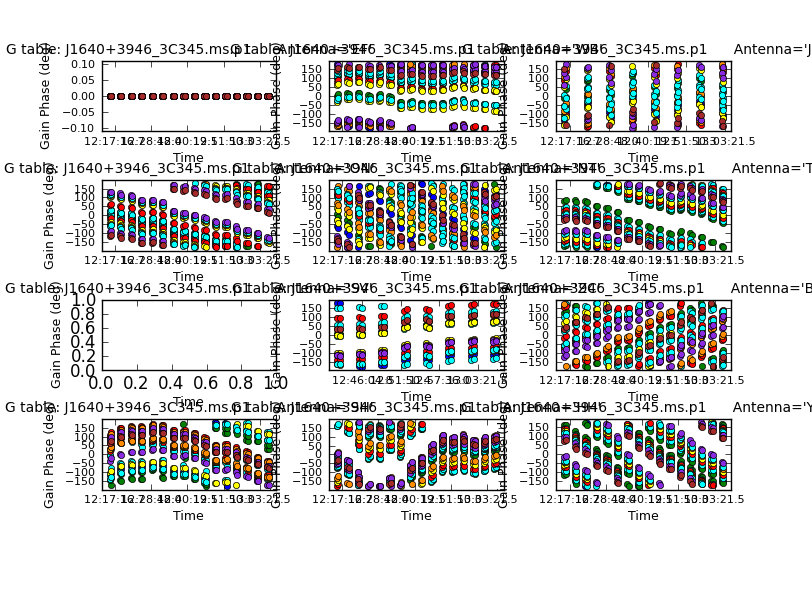

## Part 3: Calibration and imaging of 3C345
##### [<< Return to homepage](../../../index.md)
##### [<< Return to EVN continuum](../overview_page.md)

This page expects that you have used completed [part 1](../part1/part1_initial_cal.md) to get as far as applying the Tsys/gain curve, initial delay and bandpass corrections to all sources and split out 1848+283_J1849+3024.ms and J1640+3946_3C345.ms. Then you worked through [part2](../part2/part2_script_cal.md) where you calibrated and imaged a phase cal target pair.

### <a name="top">Preliminary steps & Outline</a>

This section is similar and follows similar operations but you now write the script yourself.

For this section ensure you have the following:

* J1640+3946_3C345.ms (produced during part1)
* OR, if you don't have a good version of J1640+3946_3C345.ms (remove any bad versions), get [J1640+3946_3C345.ms.tgz](http://www.jb.man.ac.uk/~radcliff/DARA/Data_reduction_workshops/EVN_Continuum/J1640+3946_3C345.ms.tgz) and extract it using `tar -zxvf J1640+3946_3C345.ms.tgz`.)
* the skeleton script `NME_3C345_skeleton.py`.
* the file `flag_Tar1Ph1.flagcmd`

**both the NME_3C345_skeleton.py and the file `flag_Tar1Ph1.flagcmd` were located in the [NME_DARA.tgz](http://www.jb.man.ac.uk/~radcliff/DARA/Data_reduction_workshops/EVN_Continuum/NME_DARA.tgz) from part1**

**Before starting**
* Copy `NME_3C345_skeleton.py` to a name of your own e.g. `cp NME_3C345_skeleton.py NME_3C345_skeleton_modified.py` so you can edit the copy (i.e. `NME_3C345_skeleton_modified.py` in this case) but you can still check the original.

`J1640+3946_3C345.ms` contains phase-ref J1640+3946 and target 3C345. You should have `J1640+3946_3C345.ms.listobs` made at the end of part 1 which shows the interleaving of the target and phase-ref.
```
12:15:20.0 - 12:16:20.0     5      0 J1640+3946               15840  [0,1,2,3,4,5,6,7]  [2, 2, 2, 2, 2, 2, 2, 2]
12:17:00.0 - 12:18:00.0     6      1 3C345                    13200  [0,1,2,3,4,5,6,7]  [2, 2, 2, 2, 2, 2, 2, 2]
12:18:40.0 - 12:19:40.0     7      0 J1640+3946               13200  [0,1,2,3,4,5,6,7]  [2, 2, 2, 2, 2, 2, 2, 2]
12:20:20.0 - 12:21:20.0     8      1 3C345                    15840  [0,1,2,3,4,5,6,7]  [2, 2, 2, 2, 2, 2, 2, 2]
12:22:00.0 - 12:23:00.0     9      0 J1640+3946               15840  [0,1,2,3,4,5,6,7]  [2, 2, 2, 2, 2, 2, 2, 2]
...
```
This section is organised as follows:
1. [Writing your own script using the skeleton](#Writing_scripts)
2. [Example](#Example)
3. [Time-dependent delay and phase calibration of phase-ref J1640+3946 (step 2)](#Time_dep_delay)
4. [Apply calibration so far, image phase ref (step 3)](#apply_so_far)
5. [Flagging (step 4)](#Flagging)
6. [Time-dependent amplitude calibration of the phase-ref (step 5)](#Time_dep_amp_cal)
7. [Apply all calibration to the phase-ref and check (step 6)](#apply_so_far)
8. [Image the calibrated phase-ref (step 7)](#im_cal_phs_ref)
9. [Apply all calibration to the target (step 9)](#Apply_all_target)
10. [Split out the target with the phase-reference solutions applied and image (step 10)](#Split_target_im)
11. [Self-calibrate target - phase (step 11)](#sc_target_p)
12. [Image phase-self-calibrated target (step 12)](#im_sc_target_p)
13. [Self-calibrate target - amplitude (step 13)](#sc_target_a)
14. [Image the target with phase and amplitude self-calibration applied (step 14)](#im_sc_target_a)

## <a name="Writing_scripts">1. Writing your own script using the skeleton</a>
[<< back to top](#top)

* Open `NME_3C345_skeleton_modified.py` (or whatever you have called it) in a text editor.

For each step we are going to figure out the correct inputs for all the tasks in a step, and then we run that step.

**Important** If you don't understand a task or parameter, use `help <task>` in CASA (and replace `<task>` with the name of the task), as in this example, as needed. You can also try inputs by hand, but don't forget to enter your final version of a task (+inputs) into this script.

To ease you into writing your own scripts, the following section describes an example step:

## <a name="Example"> 2. Example
[<< back to top](#top)

* Look at step 1 in the script `NME_3C345_skeleton_modified.py` (or whatever you have called it) using gedit or your favourite text editor.

```python
### 1) Inspect data
mystep = 1

if(mystep in thesteps):
    print 'Step ', mystep, step_title[mystep]

# Plot target and phase-ref, phase against time, averaging channels

   plotms() #<< this is empty so you have to fill it in yourself!
```

The main purpose of this step is to confirm that the phase-ref and target have phases which show a similar pattern with time; there may be an offset, but we want to check if the corrections from one will be applicable to the other.

* Firstly, let's examine the possible inputs:

```py
# in CASA
default(plotms)
inp                    # Lists parameters
```
Or:
```python
help(plotms)           # Lists parameters briefly and then repeats with more explanation/examples.
```

You can also view help for most tasks by looking at the CASA documentation:
* [CASA version 4](https://casa.nrao.edu/casa_cookbook.pdf)
* [CASA version 5](https://casa.nrao.edu/casadocs/casa-5.1.2)

You can leave most of the parameters as default, but you do need to set the following:

* visibility MS name,
* the axes to plot,
* and the channels to average.

Which parameters correspond to achieving this and how would we show how phases change with time?

* Enter the required parameters in the script, in the text editor.

In addition we may want to (to speed up plotting & ease of interpretation):
* Plot just the RR,LL correlations (we don't care about polarisation here).
* Plot all the baselines to the reference antenna only (i.e. EF) (we assume that any problems affecting an antenna will affect all its baselines)
* You can assume that all the spw are similar so you only need to plot a single spw.
* For extra convenience, set the `coloraxis` parameter to show just the fields in different colors, and the `iteraxis` so you can scroll through the baselines.

With all the appropriate parameters set, your inputs for step 1 should look something like:

```py
### 1) Inspect data
mystep = 1

if(mystep in thesteps):
    print 'Step ', mystep, step_title[mystep]

# Plot target and phase-ref, phase against time, averaging channels

   plotms(vis=phscal1+'_'+target1+'.ms',
          xaxis='time',
          yaxis='phase',
          spw='1', ## or any other
          correlation='LL,RR',
          iteraxis='baseline')
```
**Remember to make the indentations consistent and put a comma after all parameters except the last.**

When you are happy:

```py
# in CASA
mysteps=[1]
execfile('<filename>.py')

You can change the plot interactively once it appears, remember to enter any additional parameters in your script.
```

## <a name="Time_dep_delay">3. Time-dependent delay and phase calibration of phase-ref J1640+3946 (step 2)</a>
[<< back to top](#top)

Continue as above for steps 2 - make sure you try entering the missing parameters yourself first, or at least identify which you need to set, but use `NME_J1849.py` for guidance if necessary, especially if a syntax error is annoying!

The name of the calibration table and plotting commands are fixed to make it easier to check, but you can make more, different plots if you want.

If all goes to plans, below are what the delay and phase solutions should look like.




## <a name="apply_so_far">4. Apply calibration so far, image phase ref (step 3)</a>
[<< back to top](#top)

* Fill in the missing parameters for `applycal` and clean in order to apply the delay and phase corrections to the phase-ref
* Then image the phase-ref interactively.

I got a peak of 1.551, rms 0.048, S/N 32 for the image `J1640+3946_phasecal.clean.image`

Use the viewer to look at the clean image (after each clean below, too)

## <a name="Flagging">5. Flagging (step 4)</a>
[<< back to top](#top)

* For Step 4, **you can just run it as given** i.e. `mysteps=[4];execfile('<filename>.py')`. Don't spend a lot of time chasing bad data.

For future reference, for antennas with just a little bad data, e.g


you can use Hover in Tools to note the start and stop times, and manually enter in the flag command file `flagTar1Ph1.flagcmd `

`mode='manual' antenna='TR' spw='6,7' timerange='12:12:06~12:13:00'`
etc.


For a lot of bad data: You can mark it in `plotms` and then use the Locate function, and then take the information from the CASA logger; cut and paste the lines into `gedit` and then edit into the format needed for a listfile. You could even write script to do this. Here is a fragment from the logger.

```
Scan=31 Field=J1640+3946[0] Time=2014/10/22/12:59:35.0 BL=EF@EVN:01 & SH@EVN:10[0&9] Spw=1 Chan=<99999~99999> Freq=4.95024 Corr=LL
Scan=31 Field=J1640+3946[0] Time=2014/10/22/12:59:37.0 BL=EF@EVN:01 & SH@EVN:10[0&9] Spw=1 Chan=<99999~99999> Freq=4.95024 Corr=LL
Scan=32 Field=3C345[1] Time=2014/10/22/13:00:35.0 BL=EF@EVN:01 & SH@EVN:10[0&9] Spw=0 Chan=<99999~99999> Freq=4.93474 Corr=LL
Scan=32 Field=3C345[1] Time=2014/10/22/13:00:37.0 BL=EF@EVN:01 & SH@EVN:10[0&9] Spw=0 Chan=<99999~99999> Freq=4.93474 Corr=LL
Scan=32 Field=3C345[1] Time=2014/10/22/13:00:35.0 BL=EF@EVN:01 & SH@EVN:10[0&9] Spw=1 Chan=<99999~99999> Freq=4.95024 Corr=LL
```

These are incorporated in these two lines of `flagTar1Ph1.flagcmd` (the polarization is left as default, i.e. all, as if one hand is flagged the other will be ignored by calibration and imaging, so if one hand is bad, all are flagged).

We perform this after the initial phase calibration because data can be averaged
```
mode='manual' antenna='SH' spw='0,1' timerange='12:59:24~12:59:38'
mode='manual' antenna='SH' spw='0,1' timerange='13:00:34~13:00:38'
```


## <a name="Time_dep_amp_cal">6. Time-dependent amplitude calibration of the phase-ref (step 5)</a>
[<< back to top](#top)

* Fill in the missing parameters in step 5.
* Apply the two calibration tables you just made as gaintables in `gaincal`.

This is what the new amplitude correction table should look like.


## <a name="Apply_all">7. Apply all calibration to the phase-ref and check (step 6)</a>
[<< back to top](#top)

* Fill in the missing parameters for step 6 to apply these three tables to the phase-ref
* Plot the corrected amplitudes.
* Plot the corrected visibility amplitudes against time for the baselines to the refant.
* Also plot amplitude v. uv distance for all baselines.

The plots should look something like this:


## <a name="im_cal_phs_ref">8. Image the calibrated phase-ref (step 7)</a>
[<< back to top](#top)

Fill in the parameters for clean.

I got

Peak 1.749, rms 0.002, S/N 889

for the image J1640+3946_apcal.clean.image

## <a name="Apply_all_target">9. Apply all calibration to the target (step 9)</a>
[<< back to top](#top)
(Note that step 8 is usually skipped as it is not a normal part of data reduction).

* Use the phase-ref as the `gainfield` and apply the three tables you have just made to the target field. In the first `applycal`, use `antenna='!JB'` the since the existing tables cannot be applied to that antenna due to its missing scans.

In the second applycal, apply the smoothed tables to JB only.

You only need to fill in parameters for the two applycals, smoothcal is OK as it is.

## <a name="Split_target_im">10. Split out the target with the phase-reference solutions applied and image (step 10)</a>
* Fill in the inputs to split to split out the corrected data column for the target, selecting RR,LL correlations.

From now on, the new MS 3C345.ms will be the input for clean and other tasks. Fill in the inputs to clean to image the target.

I got

Peak 1.853, rms 0.297, S/N 6

for 3C345_cal0.clean.image

You can run plotms as it is. The phases are coherent but rapidly variable. This might be source structure as well as errors, so pick a short solution interval in gaincal in the next step.


You can see what the source looks like at 15 GHz at similar resolution [here]( http://www.physics.purdue.edu/astro/MOJAVE/sourcepages/1641+399.shtml) - here is one epoch (the source is variable so your image won't look quite the same).


## <a name="sc_target_p">11. Self-calibrate target - phase (step 11)</a>
[<< back to top](#top)

* Enter parameters in gaincal in step 11 for amplitude self-calibration of phase of 3C345.ms.

Previous experimenting showed that using `minsnr=3` failed many solutions, but since the data look coherent, this is probably due to an inadequate input model, i.e. the previous image model, which had very low S/N. We set `minsnr=1` which is rather dangerous, as it could pass bad solutions, but we do not want to lose good data, and hope that we can use a higher `minsnr` after more iterations of calibration.

* Enter parameters in `plotcal` to plot phase against time. There should not be wild jumps (note that +180 deg is the same as -180 deg).


* Fill in the parameters in applycal to apply this table.

**Note:** If you don't like your calibration table and decide to change a parameter and repeat this step, close the plotcal window (click on upper right x) before re-running this step.

## <a name="im_sc_target_p">Image phase-self-calibrated target (step 12)</a>
[<< back to top](#top)

* Enter the parameters in clean to image these data.

In cleaning, be guided by the image above for where to set the mask and maybe expand it during cleaning. I only got a small improvement in S/N;

Peak 1.597, rms 0.204, S/N 8

* Use plotms as it is to plot amplitude against time.

You can see that it is good and bright but there are some jumps. Note that the structure is clearest on the longest E-W baselines to SH, as expected for an E-W jet


## <a name="sc_target_a">Self-calibrate target - amplitude (step 13)</a>
[<< back to top](#top)

* Enter the parameters in `gaincal` in step 13 to perform amplitude self-calibration, applying the phase calibration table you just made.

You need a bit longer solution interval, but probably shorter than for J1849+3024. Stick with `minsnr=1` for now.


`plotcal` is set up to generate a plot of the amplitude solutions against time. If your table looks very different, with more jumps or many fewer solutions, you might want to change parameters and repeat this step.

* Enter the parameters in applycal to apply these two tables.

## <a name="im_sc_target_a">Image the target with phase and amplitude self-calibration applied (step 14)</a>
[<< back to top](#top)

* Enter the parameters in clean to make another image of the target 3C345 in step 14.
* Double the number of iterations and `npercycle` as no that the calibration is better, you can clean deeper (you can increase or decrease interactively during clean, too).
* Also, increase the imagesize to 360 pixels, to allow better deconvolution of an extended source.

Enter suitable pixel ranges `(blc, trc)` in `imstat` to measure the rms and peak in the larger image.

I got

Peak 1.747, rms 0.024, S/N 71

for 3C345_scalp1a1.clean.image.


You can see at least one jet component in the expected direction - great! The uvplot and model below look quite similar, but there still seem to be some amplitude drop-outs and spikes in the uv data and the image showed symmetric artefacts during cleaning. You can stop here, but if you wanted to try improving the image you could:

* Edit the data
* Try more self-calibration (maybe a shorter solution interval?)
* use `calmode='ap'` to calibrate phase as well as amp for the improved model
* `applymode='calflag'` which will flag failed solutions (NB use `flagmanager` first to back up previous flags)


Congratulations this is the end and you have a beautiful AGN to look at. If you get really stuck you have a script called `NME_3C345.py.gz` within the original tar file which includes all the answers.
