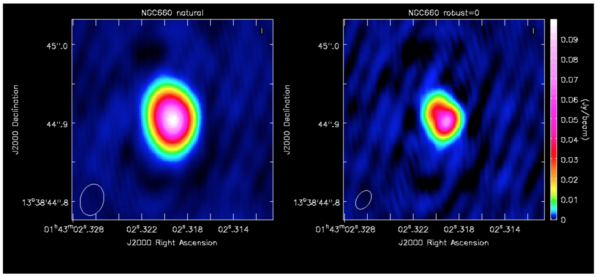
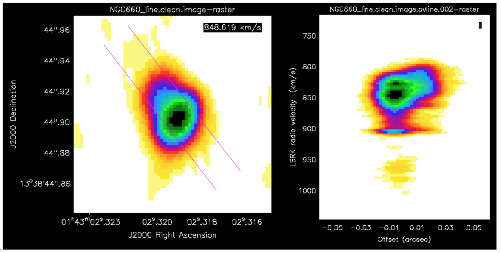
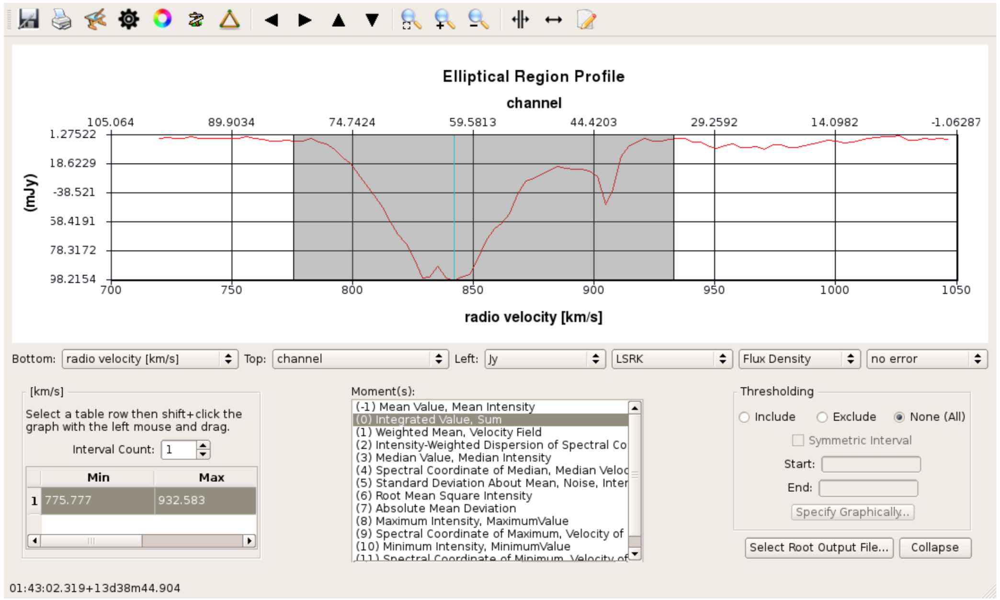
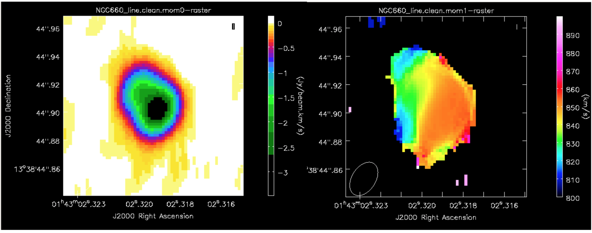
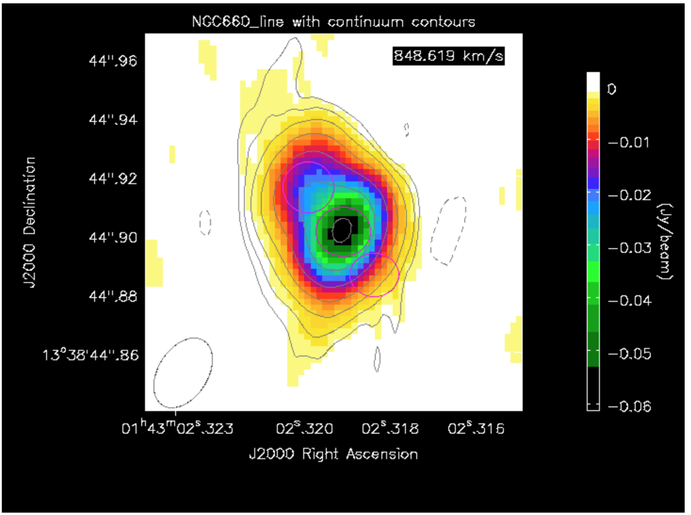
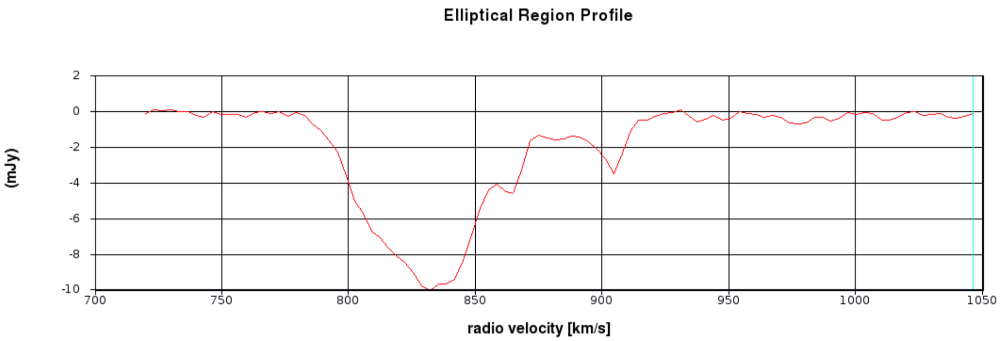
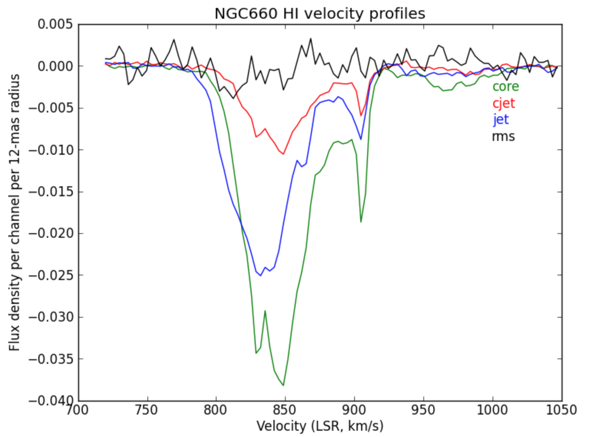
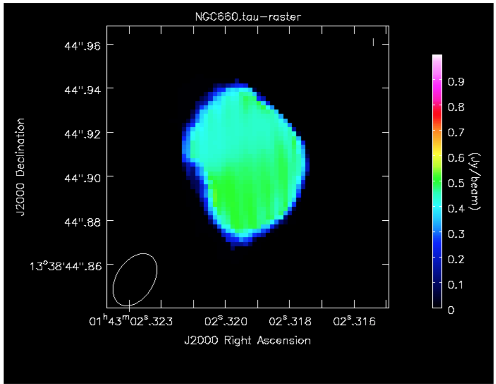

## NGC660 Hydrogen Absorption
##### [<< Return to homepage](../../index.md)
##### [<< Return to spectral line](overview_page.md)


## <a href='#top'>Imaging EVN spectral line data in CASA</a>

NGC660 is a nearby starburst galaxy with hydrogen absorption against a nuclear outburst observed in 2013 (Argo et al. 2015). It was observed using the EVN.

This guide starts with a data set which has already been flagged and calibrated using the instrumental corrections and calibration derived from astrophysical sources including phase referencing. This was done in AIPS and the split-out, calibrated data NGC660.FITS are in UVFITS format.

* Parts 1 & 2 are preparatory self-calibration and so on and can be skipped if short of time.
* Part 3 identify and image the continuum, subtract the continuum from the line and made an image cube for the line.
* And the final part performs various analyses on the cube.

About 7 GB of space is needed to run all the steps, or less if intermediate products are removed to storage.

The interactive parts will be demonstrated. An outline with the corresponding steps in the script can be found below:

1. [Data and supporting material](#Data_support)
2. [Improving calibration of NGC660](#Improve_calibration)
  * [Convert data to MS, sort and list (step 1)](#Convert_sort)
  * [Plot visibility spectrum, identify continuum, flag bad data (step 2)](#Plot_vis_flag)
  * [Plot amplitude against uv distance (step 3)](#Plot_amp_uv)
  * [Make the first image (step 4)](#First_image)
  * [Find the source position (step 5)](#Find_source)
  * [Shift the uv phase to centre on the peak and make an image (step 6)](#shift_to_source)
  * [Self-calibrate (step 7)](#self_calibrate)
3. [Image the calibrated continuum, subtract continuum from the line and make the line cube](#Image_cont_sub_cube)
  * [Image the calibrated continuum (step 8)](#Image_cal_cont)
  * [Subtract the continuum and image the line cube (step 9)](#subtract_cont)
4. [Image cube analysis](#im_cube_analysis)
  * [Make a position-velocity plot (step 10)](#pv_plot)
  * [Make moments (step 11)](#moments)
  * [Extract and plot spectra (step 12)](#extract_plot_spectra)
  * [Make an optical depth map (step 13)](#optical_depth)


## <a name="Data_support">Data and supporting material</a>
[<< back to top](#top)

* NGC660.FITS UVfits data set with instrumental and calibration source corrections applied - needed to run from start of this script.
* NGC660shift.ms.tgz data set for starting at step 8 (you make this yourself if working through steps 1-7).
* NGC660_line.clean.image.tgz and NGC660_contap1.clean.image.tgz images for analysis (you make these yourself, but just in case...)
* NGC660.py script covering the steps in this web page
* NGC660.flagcmd flags for step 2

Download instructions can be found on the [overview page](overview_page.md)

In order to use this guide, you can either:
* Run the script step by step
* Cut and paste each task from this web page
* or enter parameters line by line (in which case omit the comma at the end of each line).

If you are working from this web page you need to enter some values yourself but they are in the script.

## <a name="Improve_calibration">Improving calibration of NGC660</a>
### <a name="Convert_sort">a. Convert data to MS, sort and list (step 1)</a>
[<< back to top](#top)

* These data are from AIPS, which exports visibilities in UVFITS format, therefore we need to convert to a measurement set first:

```py
# In CASA
os.system('rm -rf NGC660_unsort.ms*')
importuvfits(fitsfile='NGC660.FITS', vis='NGC660_unsort.ms')
```
* UVFITS data have to be sorted to improve later processing speed

```py
# In CASA
os.system('rm -rf NGC660.ms*')
from recipes.setOrder import setToCasaOrder
setToCasaOrder(inputMS='NGC660_unsort.ms', outputMS='NGC660.ms')
```

* Now lets see what is in the data.
```py
# In CASA
os.system('rm -rf NGC660.ms.listobs')
listobs(vis='NGC660.ms', listfile='NGC660.ms.listobs')
```

The `listobs` output shows that NGC660 is the only source in the data, and there is just one spw with 1024 channels. There are 7 antennas.

```
Fields: 1
ID Code Name RA Decl Epoch SrcId nRows
 0 NGC660 01:43:02.319236 +13.38.44.90526 J2000 0 49159
Spectral Windows: (1 unique spectral windows and 1 unique polarization setups)
SpwID Name #Chans Frame Ch0(MHz) ChanWid(kHz) TotBW(kHz) CtrFreq(MHz) Corrs
0 none 1024 TOPO 1408.376 15.625 16000.0 1416.3678 RR LL
Antennas: 7:
...
```

### <a name="Plot_vis_flag">b. Plot visibility spectrum, identify continuum, flag bad data (step 2)</a>
[<< back to top](#top)

As before, EF (Effelsberg) is the most sensitive antenna and is used as the reference antenna.
* Plot amplitude against channel. Note that the end channels and some around channel 775 have been flagged.

```py
# In CASA
plotms(vis='NGC660.ms',
xaxis='channel', yaxis='amp',
avgtime='36000', antenna='EF&*',
iteraxis='baseline', avgscan=True)
```


The absorption can be seen clearly but there are some remaining bad data.

* Select the continuum channel ranges, excluding about 100 channels around the line and define this the variable `contchans` (i.e. fill in xxx and yyy) and enter this into CASA

```py
contchans='0:100~xxx;yyy~900'
```

* Plot the data to identify the bad data using Mark and Locate (this has already been done and entered in `NGC660.flagcmd`). The high data points are not flagged as they are mostly just mis-scaled and will be calibrated later.

```py
# In CASA
plotms(vis='NGC660.ms',
xaxis='time',
yaxis='amp',
avgchannel='801', # average all channels as non-continuous ranges are not handled)
antenna='EF&*',
coloraxis='antenna2')
```


* Back up the existing flagging state and apply the flag list

```py
# In CASA
flagmanager(vis='NGC660.ms',
mode='save', versionname='prelist')

flagdata(vis='NGC660.ms', mode='list',
inpfile='NGC660.flagcmd')
```

* Reload `plotms` to check the bad data have gone and zoom in on some of the high amplitudes in order to estimate a suitable solution interval for later calibration.


### <a name="Plot_amp_uv">c. Plot amplitude against uv distance (step 3)</a>
[<< back to top](#top)

```py
# In CASA
plotms(vis='NGC660.ms',
xaxis='uvdist', yaxis='amp',
avgchannel='801', avgtime='30',
coloraxis='antenna1')
```


This shows that the dropouts have gone.

* Use it to identify the longest baseline and use that and the wavelength to estimate the synthesised beam resolution and thus a suitable imaging cell size (see EVN continuum part2, step 3).

```py
cellsize='x.xxxarcsec'
```

### <a name="First_image">d. Make the first image (step 4)</a>
[<< back to top](#top)

The galaxy position was only known to about an arcsecond so we make a ~2" image.

Remember to:
* Set parameter `contchans` from step 2
* Set suitable number of pixels (parameter `imsize`) to cover about 2 arcsec
* and set `cellsize` based upon the calculation above.

```py
# In CASA
os.system('rm -rf NGC660_cont0.clean*')
clean(vis='NGC660.ms',
imagename='NGC660_cont0.clean', field='NGC660',
spw=contchans, imsize=[xxx,xxx],
cell=cellsize, weighting='natural',
niter=100, interactive=True, npercycle=25)
```

### <a name="Find_source">e. Find the source position (step 5)</a>
[<< back to top](#top)

* Display `NGC660_cont0.clean.image` in the viewer.

```py
# in CASA
viewer('NGC660_cont0.clean.image')
```


You can draw an ellipse round the source and fit a 2-D Gaussian component interactively using the Region Fit tab.

* However it is better to script this using the task `imfit`, which then produces a log file (which in this case is called `NGC660_contpeakpos.txt`).

```py
# In CASA
imfit(imagename='NGC660_cont0.clean.image',
box='blcx, blcy, trcx, trcy',logfile='NGC660_contpeakpos.txt')
# set pixel coordinates for a box about 70 mas on a side enclosing the source
# blc = bottom left corner, trc = top right corner
```
* Look at `NGC660_contpeakpos.txt` and find the peak position in sexagesimal (hms, dms) format:

```
   ...
Fit on NGC660_cont0.clean.image component 0 Position ---
--- ra: HH:MM:SS.SSSSSS +/- 0.000060 s (0.000877 arcsec along great circle)
--- dec: +0DD:MM:SS.SSSSS +/- 0.001500 arcsec
```

This offset is about 1 arcsec which is well within the primary beam and should not affected by bandwidth or time smearing.

### <a name="shift_to_source">f. Shift the uv phase to centre on the peak and make an image (step 6)</a>
[<< back to top](#top)

The task `fixvis` is used to calculate and apply the phase shifts needed to place the source at the centre of the field. This makes continuum subtraction more accurate as well as making imaging more convenient.

* Use `fixvis` and set the `phasecenter` parameter to be the position you fitted to the source i.e.:

```py
# In CASA
fixvis(vis='NGC660.ms',
outputvis='NGC660shift.ms',
phasecenter='J2000 HHhMMmSS.SSSSSS +DDdMMmSS.SSSSS')
# Insert HH etc. from the position you found above (omit the leading 0 from Dec)
```

* Image the new measurement set

```py

os.system('rm -rf NGC660_cont1.clean*')
clean(vis='NGC660shift.ms',
imagename='NGC660_cont1.clean', field='NGC660',
spw=contchans, # You should have set contchans from step 2
imsize=256, # Smaller image size now the source is in the centre.
cell=cellsize,# You should have set cellsize from step 3
weighting='natural', niter=50,
interactive=True, npercycle=25)
```

* Measure the peak brightness and rms

```py
# In CASA
rms=imstat(imagename='NGC660_cont1.clean.image',
box='offblcx,offblcy,offtrcx,offtrcy')['rms'][0]
# Set blc and trc of a largeish box well clear of the source
peak=imstat(imagename='NGC660_cont1.clean.image',
box='blcx,blcy,trcx,trcy')['max'][0]
# Set blc and trc to enclose the source

print 'Peak %6.3f, rms %6.3f, S/N %6.0f' % (peak, rms, peak/rms)
```
I got a peak brightness 0.103 Jy/bm, rms 0.009 Jy/bm, S/N 11

### <a name="self_calibrate">g. Self-calibrate (step 7)</a>
[<< back to top](#top)

The visibility amplitudes show that there is good signal to noise on all baselines to EF. The data are mostly well calibrated but there are the discrepant amplitudes noted above, so solve for amplitude and phase. Note that the parallactic angle correction was applied prior to creating the data set we loaded.

* Look at the zoomed plot of amplitude against time at the end of Step 2. The systematic trands in the amplitude errors seem to be greater than the noise scatter on timescales between 20-60 sec, so pick a solution interval in this range.

```py
# In CASA
gaincal(vis='NGC660shift.ms',
caltable='NGC660.ap1',
solint='XXs', # Set the solution interval
 minsnr=1, minblperant=2)
## and plot!
plotcal(caltable='NGC660.ap1', xaxis='time', yaxis='amp',
subplot=431, iteration='antenna')
```


The solutions are mostly coherent and near to unity except for the antennas which did have the high amplitudes.

* Apply the calibration.

```py
applycal(vis='NGC660shift.ms',
gaintable='NGC660.ap1',
applymode='calonly')
```

## <a name="Image_cont_sub_cube">3. Image the calibrated continuum, subtract continuum from the line and make the line cube</a>
[<< back to top](#top)

If you performed steps 1-7 you should have `NGC660shift.ms`, but if not, a copy is provided.

**ONLY IF** you don't have NGC660shift.ms or if you have problems with your current copy:

* Move or delete any existing NGC660shift.ms and
* `tar -zxvf NGC660shift.ms.tgz`

### <a name="Image_cal_cont">a. Image the calibrated continuum (step 8)</a>
[<< back to top](#top)

If you did not do this already, look at the first plot in step 2 above.

* Select the continuum channel ranges, excluding about 100 channels around the line and define this as contchans (fill in xxx and yyy) & enter into CASA:

```py
contchans='0:100~xxx;yyy~900
```

The plot in step 3 above shows the longest uv distance in metres, which you can use with the wavelength to estimate the synthesised beam resolution and thus a suitable imaging cell size. You may already have established these values in step 4, or see see EVN continuum part 2, step 3.

In `clean`, `robust=0` gives higher weight to the interpolation into the missing spacings, which favours the long baselines and produces a smaller restoring beam, in order to separate core and jet.

* We use this to `clean` our continuum emission:

```py
# In CASA
os.system('rm -rf NGC660_contap1.clean*')
clean(vis='NGC660shift.ms',
imagename='NGC660_contap1.clean',
field='NGC660',
spw=contchans, imsize=256,
cell=cellsize, weighting='briggs',
robust=0, niter=200,
interactive=True, npercycle=50)
```

* Inspect the image

```py
# in CASA
viewer('NGC660_contap1.clean.image')
```
You can measure the peak (or rms) by drawing a box around (or excluding) the source and double-clicking, which gives values in the terminal.

* Measure the peak and rms using the task `imstat` (so you can use a standard box, for example)

```py
# In CASA
imstat(imagename='NGC660_contap1.clean.image',
box='blcx,blcy,trcx,trcy') # Set blc and trc to enclose the source
```

This produces a list (actually a python dictionary) of values. It is easier to extract just the ones we want:

```py
# In CASA
rms=imstat(imagename='NGC660_contap1.clean.image',
box='offblcx,offblcy,offtrcx,offtrcy')['rms'][0] # Set blc and trc of a largeish box well clear of the source
peak=imstat(imagename='NGC660_cont1.clean.image',
box='blcx,blcy,trcx,trcy')['max'][0] # Set blc and trc to enclose the source
print 'Peak %6.3f, rms %6.3f, S/N %6.0f' % (peak, rms, peak/rms)
```

I got a peak brightness of 0.0760 Jy/b, rms 0.0003 Jy/b, S/N 231 which is a great improvement on the pre-self-cal values in step 6; the lower peak is due to the smaller beam size.

This plot shows the difference between a self-calibrated image made with natural weighting (lower noise - more sensitive to extended emission) and this image made with robust=0 (higher resolution).



### <a name="subtract_cont">b. Subtract the continuum and image the line cube (step 9)</a>
[<< back to top](#top)

`uvcontsub` takes the model of Fourier transformed Clean Components in the MS and subtracts these from the corrected visibility data. In this option, this is calculated per integration for a first order (straight line with a slope) fit to the channels specified by `contchans`, interpolated across the line channels in between.

* Let's remove the continuum:
```py
# In CASA
os.system('rm -rf NGC660shift.ms.contsub*')
uvcontsub(vis='NGC660shift.ms',
fitspw=contchans, fitorder=1)
```

This produces an MS ()`NGC660shift.ms.contsub`) which should have just noise remaining in the `contchans`.

In order to get an image cube with the correct velocities, you need to set the line rest frequency. Assuming that you only remember the rough rest frequency of the HI 21-cm line, you can get an accurate value using CASA task `slsearch`:

```py
slsearch(freqrange=[1.42,1.43],# Set approx. lower and upper frequency limits in GHz
rrlinclude=False, # Don't include radio recombination lines
logfile='NGC660_HIrest.log', # Outfile
verbose=True,# Replace any previous outfile
append=False)
```

which should output something like:
```
SPECIES RECOMMENDED CHEMICAL_NAME FREQUENCY QUANTUM_NUMBERS INTENSITY SMU2 LOGA EL EU LINELIST
H-atom      * Atomic Hydrogen 1.420410 2S1/2,F=1-0 -9.06120 0.00026 -14.54125 0.00000 0.06817 JPL
 g-CH3CH2OH * gauche-Ethanol 1.420760 35(7,28)-35(7,29),vt -9.81460 4.41121 -11.68321 641.53949 641.60767 JPL
CH3NH2      * Methylamine    1.422950 17(0)E2+1-16(3)E2+1, 0.00000 0.00700 -12.62939 324.64233 324
...
```

where HI is the very first entry, at 1.420410 GHz.

* Next we select the line channels in between to image.

The default in clean, which we have used so far, is to average all channels to make a continuum map. Now, use `mode='channel'` to image each channel separately (or as determined by parameter width, if you want to average for more sensitivity).

* Choose the start channel as the end of the first chunk of continuum, and set `nchans` to the number of central channels which you did not use for continuum (i.e. the number of channels for the output cube, not the original channel number).

**Note** By default CASA uses the radio convention for converting frequency shift to velocity, that is:


* Once clean starts, scroll through to the central channels (e.g. 60) where you can see absorption, select all channels and set a mask.

```py
# In CASA
os.system('rm -rf NGC660_line.clean*')
clean(vis='NGC660shift.ms.contsub',
imagename='NGC660_line.clean',
field='NGC660',
mode='channel', # Clean each channel separately
start=***, # Set to the first channel in the interval between the line free channels (contchans)
width=1,# No averaging
nchan=***, # Set to the number of channels needed to cover the line, up to the other end of the interval
outframe='lsrk', # Use the Local Standard of Rest reference frame
restfreq='X.XXXXXXGHz',# Set the accurate rest frequency for HI
imsize=256,
cell=cellsize,# You should have set cellsize from step 3
weighting='briggs',
robust=0,
niter=100, interactive=True,
npercycle=25)
```

* We can use `imstat` to provide statistics for the whole cube, and the channel with the minimum can be identified:

```py
rms=imstat(imagename='NGC660_line.clean.image', box='6,200,250,250')['rms'][0]
peak=imstat(imagename='NGC660_line.clean.image', box='100,100,156,156')['min'][0]
peakchan=imstat(imagename='NGC660_line.clean.image', box='100,100,156,156')['minpos'][3]
print 'Max. absorption %6.4f, in chan %3i, rms %6.4f, S/N %6.0f' % (peak, peakchan, rms, abs(peak/rms))
```

I got a max. absorption of -0.0614, in chan 60, rms 0.0005, S/N 113

* Take a look at the cube in the viewer and experiment with the look-up table and so on. You can also open the continuum image on top as contours.

## <a name="im_cube_analysis">4. Image cube analysis</a>
[<< back to top](#top)

By the end of steps 8 and 9 you should have your own line and continuum images, but if not, untar `NGC660_line.clean.image.tgz` and `NGC660_contap1.clean.image.tgz` as described before step 8.

Some of the analysis steps here, i.e. PV slicing, making moments and extracting spectra, can be done interactively in the viewer, which is useful for deciding what parts of the image to include, but it is then better to script using the equivalent tasks so that you can repeat the steps.

### <a name="pv_plot">a. Make a position-velocity plot (step 10)</a>
[<< back to top](#top)

You can collapse the spatial dimension along an arbitrary direction and plot the averaged flux density against velocity, known for short as a PV plot.

* Display NGC660_line.clean.image in the viewer and select channel 60, to decide where to draw the slice, along the jet axis.
* In the Regions PV tab, change the coordinates to pixels and set the width to 11 pixels. Note the values (to use in the equivalent task) and create the PV plot.



This shows the peak channel of the image on the left, overlaid with the slice I drew, and the PV diagram on the right (using the rainbow4 look-up table; black is most negative, yellow approx. noise level)

* You can do the same using `impv`:

```py
# In CASA
impv(imagename='NGC660_line.clean.image',
outfile='NGC660.pv', # Set limits as identified in the viewer #
start=[blc1,trc1],
end=[blc2,trc2],
width=11) # Change if you like)
```

### <a name="moments">b. Make moments (step 11)</a>
[<< back to top](#top)

Moment 0 is defined as:


for intensity I per velocity channel, at each pixel, summed across all channels of width dV, in units Jy/beam km/s

Moment 1 is defined as:


in units km/s (where V is velocity)

* Load the line image cube in the viewer, go to a channel with strong absoprtion such as 60 and select the moments tool. This will present the spectral profiler.
* Draw an ellipse round the core and see the spectrum.
* Shift-click in the spectral profile tool to select the channels covering the line.
* Select the zeroth moment (total intensity).
* Note the start and stop channels (approximately) and click on Collapse.



* Or you can script this using the task `immoments`

```py
# In CASA
os.system('rm -rf NGC660_line.clean.mom0')
immoments(imagename='NGC660_line.clean.image',
moments=[0],
chans='XX~YY',# set channel range so we just cover the line signal
outfile='NGC660_line.clean.mom0')
```

When making the first moment, flux-weighted velocity, you need to exclude the noise. About 4 x the rms (see the end of step 9) is about right for the lower limit, as a negative; set a high upper limit to exclude since we are only interested in absorption.

```py
# In CASA
os.system('rm -rf NGC660_line.clean.mom1')
immoments(imagename='NGC660_line.clean.image',
moments=[1],
chans='XX~YY', # Channel range just covering the line signal
excludepix=[XXX,1], # Set the lower limit to the negative of about 4x noise rms
outfile='NGC660_line.clean.mom1')
```


This shows the zeroth moment and the first moment made using a cutoff of -0.002 Jy/bm, with some tweaking of the colour scale. You can see a gradient from blue-shifted at the side of the more prominent NE jet, to redshifted towards the weaker counter-jet.

### <a name="extract_plot_spectra">c. Extract and plot spectra (step 12)</a>
[<< back to top](#top)

* Load the spectral cube in the viewer, go to a channel with strong absorption e.g. 60, and overplot the continuum contours.
* Click on the spectral profile tool.
* Draw 3 ellipses on the core and in the direction of the NE jet and the fainter counter-jet.

In practice, you might have other information to help decide where it is interesting to extract a spectrum. When you click in one of the ellipses, the spectrum appears in the spectral profile tool. You can also get the coordinates (in pixels) from the Region tab.




Scripting uses a tool, `ia` (which stands for for image analysis) to extract the spectra and then we can use raw python to make a plot. This is particularly convenient to put into a script for future use. The following describes how we do that!

* Define the centres of the three positions; I have set all the radii to 6 pixels (what is that in arcsec?) but they don't have to be the same. This is a python dictionary, where the keys ('jet' etc.) are associated with a value (the definition of each circle).

```py
# In CASA
rgns={'jet':'circle[[123.3pix, 133.6pix], 6pix]',
'core':'circle[[129.3pix, 126.0pix], 6pix]',
'cjet':'circle[[134.5pix, 118.6pix], 6pix]',
'rms':'box[[10pix,10pix],[100pix,50pix]]'}
```

* Use the `ia` tool to get the spectral profile at each of the 3 positions and an off-source noise box and write them to text files.

```py
#python
ia.open('NGC660_line.clean.image')
for r in rgns:
  outfile=open(r+'.spec', 'w')# create empty text files called 'jet.spec' etc. in writeable mode
  f=ia.getprofile(axis = 3, # extract the profile and store it in variable f
      function = 'flux',
      region = rgns[r],
      unit='km/s',
      spectype='radio velocity')
  for z in zip(f['coords'],f['values']):# python to extract the velocity and flux arrays from f in a suitable format
    print >> outfile, z[0], z[1] # print these to the outfile
  outfile.close()
ia.close()
```
We could have passed the profiles directly to a plotter, but like this, you now have the \*.spec files on disk to use as you like.

* We use python to plot the spectra:

```py
import matplotlib.pyplot as plt
cols={'jet':'b','core':'g','cjet':'r','rms':'k'}
# The colors for each spectrum (use help(plt.colors) for others)
plt.clf() # clear previous plots
for i in range(len(rgns)):
  v=[];f=[]
  for l in open(rgns.keys()[i]+'.spec'): # Read the disk files back into arrays
    v.append(float(l.split()[0])) # Array of velocities for x-axis
    f.append(float(l.split()[1])) # Array of flux density values for y-axis
    plt.plot(v,f,color=cols[rgns.keys()[i]])  # Plot the spectra
    plt.text(1000,(-0.003-i*0.002),rgns.keys()[i],color=cols[rgns.keys()[i]]) # Plot some labels, underneath each other.
plt.xlabel('Velocity (LSR, km/s)')
plt.ylabel('Flux density per channel per 12-mas radius')
plt.title('NGC660 HI velocity profiles')
plt.savefig('NGC660_HIvelocityprofiles.png') # Write the plot to a png
```


### <a name="optical_depth">d. Make an optical depth map (step 13)</a>
[<< back to top](#top)

In the optically thin approximation, optical depth is given by:


 where  is the flux density of the continuum-subtracted line and  is the flux density of the continuum. This can be done for single planes of the cube or for an average of many planes.

 We are going to make an average of the most intense absorption, e.g. below half-minimum:

 ```py
 # in CASA
os.system('rm -rf NGC660_line.mean')
immoments(imagename='NGC660_line.clean.image',
moments=[-1],
chans='55~69',
excludepix=[-0.002,1],
outfile='NGC660_line.mean')
```

* Expressions such as for optical depth can be coded in `immath`:

```py
# in CASA
os.system('rm -rf NGC660.tau') immath(imagename=['NGC660_contap1.clean.image','NGC660_line.mean'],
mode='evalexpr',
 expr='-1.*log(-1.*IM1/IM0)',
 outfile='NGC660.tau')
```
* In the viewer, set the range of values to [0,1] to exclude noise pixels



Hooray, that completes the spectral line guide. For more information of the science refer to the Argo+15 paper!
