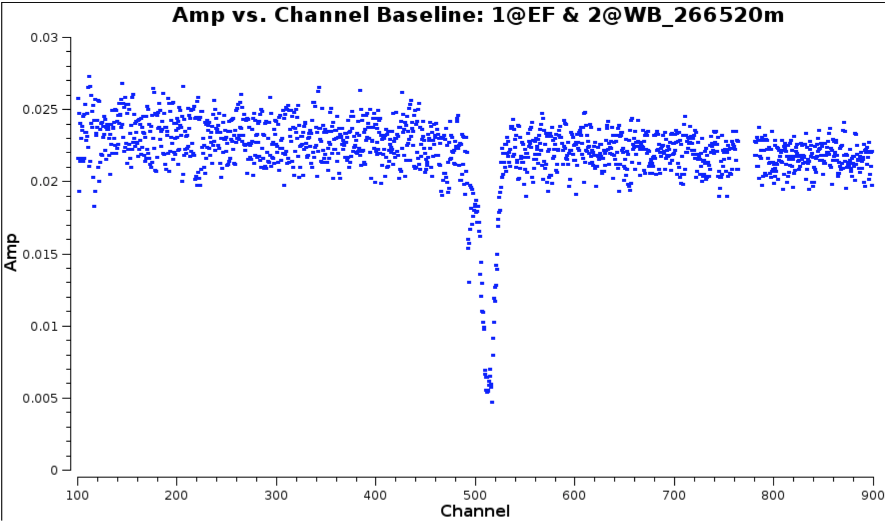
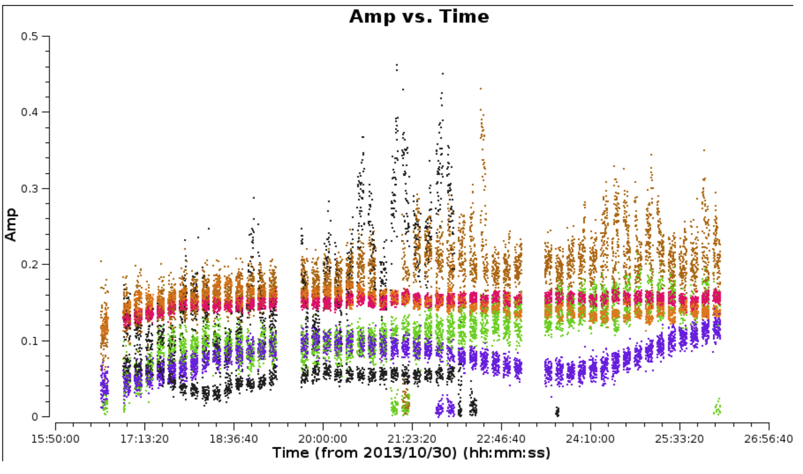
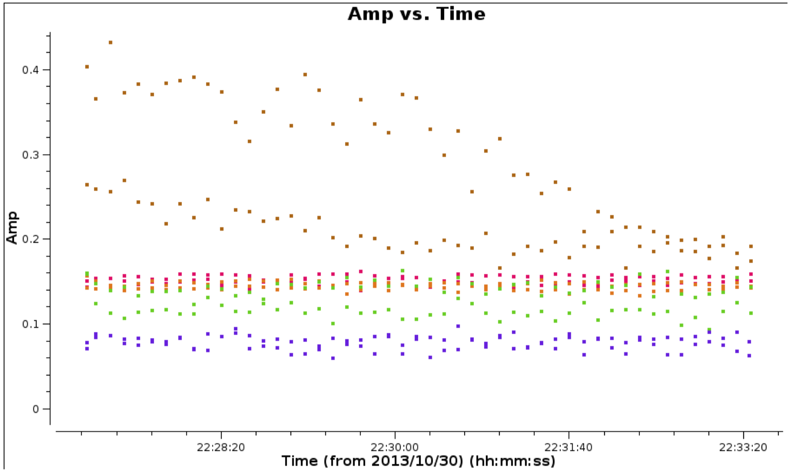
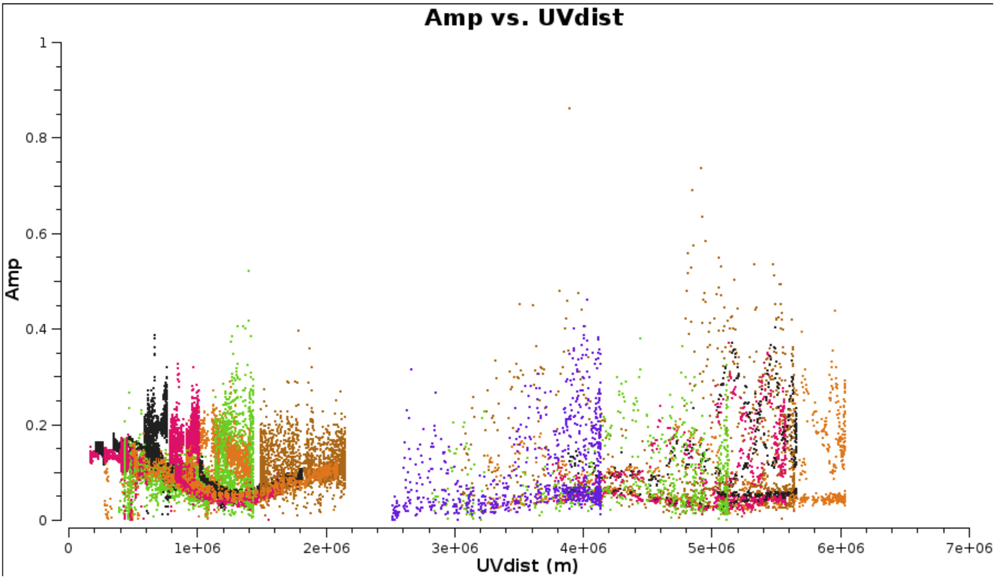
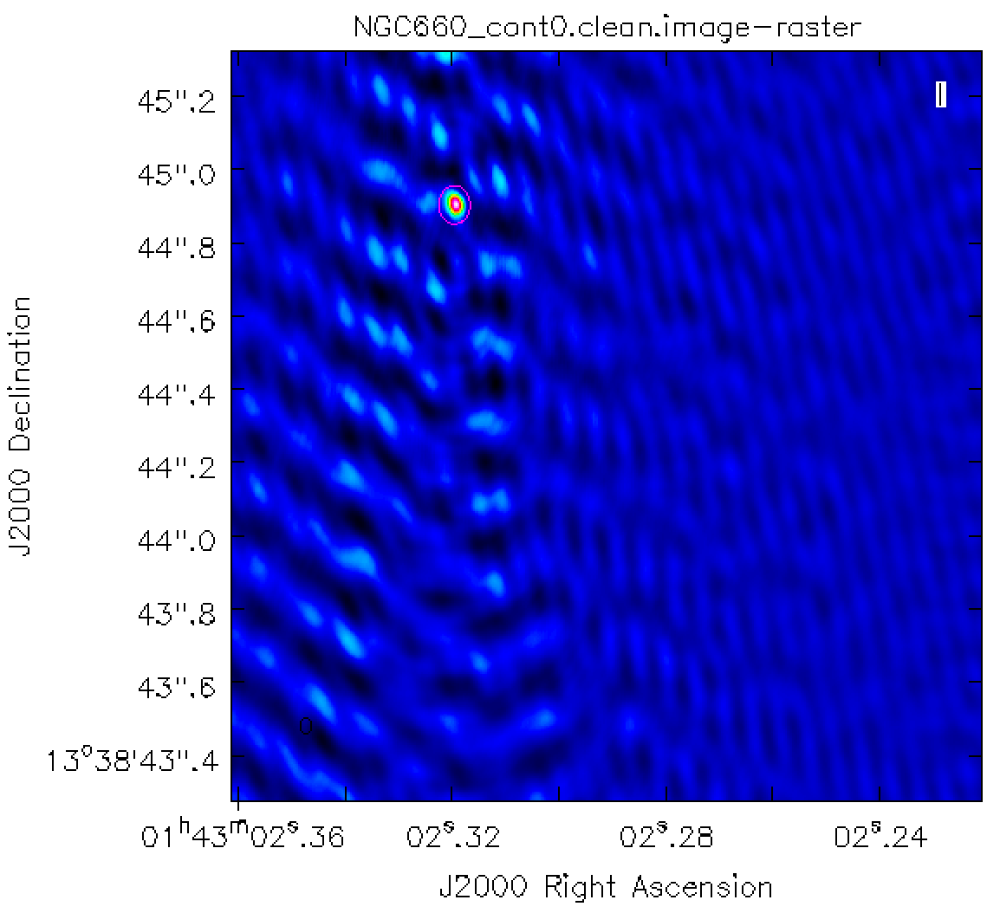
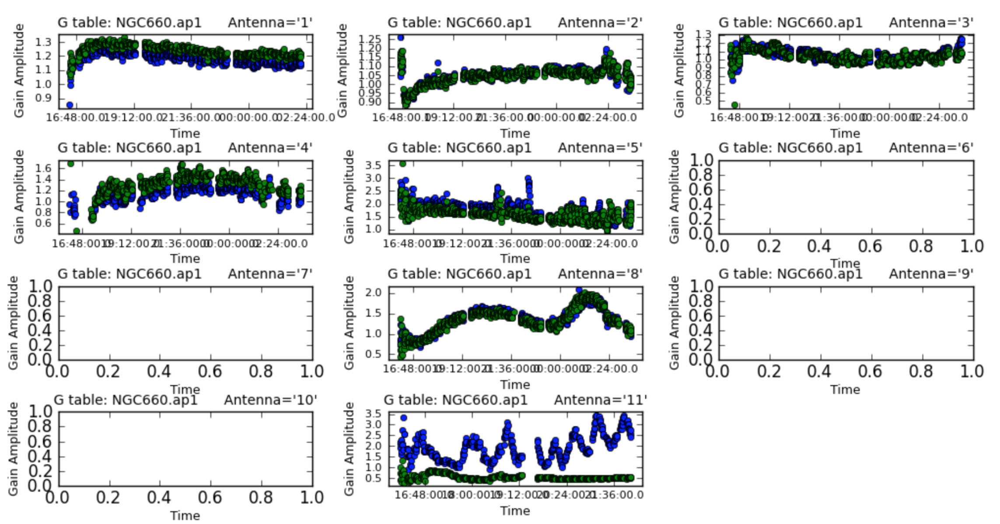

## NGC660 Hydrogen Absorption
##### [<< Return to homepage](../../index.md)
##### [<< Return to spectral line](overview_page.md)


## <a href='#top'>Imaging EVN spectral line data in CASA</a>

NGC660 is a nearby starburst galaxy with hydrogen absorption against a nuclear outburst observed in 2013 (Argo et al. 2015). It was observed using the EVN.

This guide starts with a data set which has already been flagged and calibrated using the instrumental corrections and calibration derived from astrophysical sources including phase referencing. This was done in AIPS and the split-out, calibrated data NGC660.FITS are in UVFITS format.

* Parts 1 & 2 are preparatory self-calibration and so on and can be skipped if short of time.
* Part 3 identify and image the continuum, subtract the continuum from the line and made an image cube for the line.
* And the final part performs various analyses on the cube.

About 7 GB of space is needed to run all the steps, or less if intermediate products are removed to storage.

The interactive parts will be demonstrated. An outline with the corresponding steps in the script can be found below:

1. [Data and supporting material](#Data_support)
2. [Improving calibration of NGC660](#Improve_calibration)
  * [Convert data to MS, sort and list (step 1)](#Convert_sort)
  * Plot visibility spectrum, identify continuum, flag bad data (step 2)
  * Plot amplitude against uv distance (step 3)
  * Make the first image (step 4)
  * Find the source position (step 5)
  * Shift the uv phase to centre on the peak and make an image (step 6)
  * Self-calibrate (step 7)
3. Image the calibrated continuum, subtract continuum from the line and make the line cube
  * Image the calibrated continuum (step 8)
  * Subtract the continuum and image the line cube (step 9)
4. Image cube analysis
  * Make a position-velocity plot (step 10)
  * Make moments (step 11)
  * Extract and plot spectra (step 12)
  * Make an optical depth map (step 13)


## <a name="Data_support">Data and supporting material</a>

* NGC660.FITS UVfits data set with instrumental and calibration source corrections applied - needed to run from start of this script.
* NGC660shift.ms.tgz data set for starting at step 8 (you make this yourself if working through steps 1-7).
* NGC660_line.clean.image.tgz and NGC660_contap1.clean.image.tgz images for analysis (you make these yourself, but just in case...)
* NGC660.py script covering the steps in this web page
* NGC660.flagcmd flags for step 2

Download instructions can be found on the [overview page](overview_page.md)

In order to use this guide, you can either:
* Run the script step by step
* Cut and paste each task from this web page
* or enter parameters line by line (in which case omit the comma at the end of each line).

If you are working from this web page you need to enter some values yourself but they are in the script.

## <a name="Improve_calibration">Improving calibration of NGC660</a>
### <a name="Convert_sort">a. Convert data to MS, sort and list (step 1)</a>


* These data are from AIPS, which exports visibilities in UVFITS format, therefore we need to convert to a measurement set first:

```py
# In CASA
os.system('rm -rf NGC660_unsort.ms*')
importuvfits(fitsfile='NGC660.FITS', vis='NGC660_unsort.ms')
```
* UVFITS data have to be sorted to improve later processing speed

```py
# In CASA
os.system('rm -rf NGC660.ms*')
from recipes.setOrder import setToCasaOrder
setToCasaOrder(inputMS='NGC660_unsort.ms', outputMS='NGC660.ms')
```

* Now lets see what is in the data.
```py
# In CASA
os.system('rm -rf NGC660.ms.listobs')
listobs(vis='NGC660.ms', listfile='NGC660.ms.listobs')
```
The `listobs` output shows that NGC660 is the only source in the data, and there is just one spw with 1024 channels. There are 7 antennas.
```
Fields: 1
ID Code Name RA Decl Epoch SrcId nRows
 0 NGC660 01:43:02.319236 +13.38.44.90526 J2000 0 49159
Spectral Windows: (1 unique spectral windows and 1 unique polarization setups)
SpwID Name #Chans Frame Ch0(MHz) ChanWid(kHz) TotBW(kHz) CtrFreq(MHz) Corrs
0 none 1024 TOPO 1408.376 15.625 16000.0 1416.3678 RR LL
Antennas: 7:
...
```

###<a name="Plot_vis_flag">b. Plot visibility spectrum, identify continuum, flag bad data (step 2)</a>

As before, EF (Effelsberg) is the most sensitive antenna and is used as the reference antenna.
* Plot amplitude against channel. Note that the end channels and some around channel 775 have been flagged.

```py
# In CASA
plotms(vis='NGC660.ms',
xaxis='channel', yaxis='amp',
avgtime='36000', antenna='EF&*',
iteraxis='baseline', avgscan=T)
```



The absorption can be seen clearly but there are some remaining bad data.

* Select the continuum channel ranges, excluding about 100 channels around the line and define this the variable `contchans` (i.e. fill in xxx and yyy) and enter this into CASA

```py
contchans='0:100~xxx;yyy~900'
```

* Plot the data to identify the bad data using Mark and Locate (this has already been done and entered in `NGC660.flagcmd`). The high data points are not flagged as they are mostly just mis-scaled and will be calibrated later.

```py
# In CASA
plotms(vis='NGC660.ms',
xaxis='time',
yaxis='amp',
avgchannel='801', # average all channels as non-continuous ranges are not handled)
antenna='EF&*',
coloraxis='antenna2')
```



* Back up the existing flagging state and apply the flag list

```py
# In CASA
flagmanager(vis='NGC660.ms',
mode='save', versionname='prelist')

flagdata(vis='NGC660.ms', mode='list',
inpfile='NGC660.flagcmd')
```

* Reload `plotms` to check the bad data have gone and zoom in on some of the high amplitudes in order to estimate a suitable solution interval for later calibration.



### <a name="Plot_amp_uv">c. Plot amplitude against uv distance (step 3)</a>

```py
# In CASA
plotms(vis='NGC660.ms',
xaxis='uvdist', yaxis='amp',
avgchannel='801', avgtime='30',
coloraxis='antenna1')
```



This shows that the dropouts have gone.

* Use it to identify the longest baseline and use that and the wavelength to estimate the synthesised beam resolution and thus a suitable imaging cell size (see EVN continuum part2, step 3).

```py
cellsize='x.xxxarcsec'
```

###<a name="First_image">d. Make the first image (step 4)</a>

The galaxy position was only known to about an arcsecond so we make a ~2" image.

Remember to:
* Set parameter `contchans` from step 2
* Set suitable number of pixels (paramter `imsize`) to cover about 2 arcsec
* and set `cellsize` based upon the calculation above.

```py
# In CASA
os.system('rm -rf NGC660_cont0.clean*')
clean(vis='NGC660.ms',
imagename='NGC660_cont0.clean', field='NGC660',
spw=contchans, imsize=[xxx,xxx],
cell=cellsize, weighting='natural',
niter=100, interactive=True, npercycle=25)
```

###<a name="Find_source">e. Find the source position (step 5)</a>

* Display `NGC660_cont0.clean.image` in the viewer.

```py
# in CASA
viewer('NGC660_cont0.clean.image')
```



You can draw an ellipse round the source and fit a 2-D Gaussian component interactively using the Region Fit tab.

* However it is better to script this using the task `imfit`, which then produces a log file (which in this case is called `NGC660_contpeakpos.txt`).

```py
# In CASA
imfit(imagename='NGC660_cont0.clean.image',
box='blcx, blcy, trcx, trcy',logfile='NGC660_contpeakpos.txt')
# set pixel coordinates for a box about 70 mas on a side enclosing the source
# blc = bottom left corner, trc = top right corner
```
* Look at `NGC660_contpeakpos.txt` and find the peak position in sexagesimal (hms, dms) format:

```
   ...
Fit on NGC660_cont0.clean.image component 0 Position ---
--- ra: HH:MM:SS.SSSSSS +/- 0.000060 s (0.000877 arcsec along great circle)
--- dec: +0DD:MM:SS.SSSSS +/- 0.001500 arcsec
```

This offset is about 1 arcsec which is well within the primary beam and should not affected by bandwidth or time smearing.

###<a name="shift_to_source">f. Shift the uv phase to centre on the peak and make an image (step 6)</a>

The task `fixvis` is used to calculate and apply the phase shifts needed to place the source at the centre of the field. This makes continuum subtraction more accurate as well as making imaging more convenient.

* Use `fixvis` and set the `phasecenter` parameter to be the position you fitted to the source i.e.:

```py
# In CASA
fixvis(vis='NGC660.ms',
outputvis='NGC660shift.ms',
phasecenter='J2000 HHhMMmSS.SSSSSS +DDdMMmSS.SSSSS')
# Insert HH etc. from the position you found above (omit the leading 0 from Dec)
```

* Image the new measurement set

```py

os.system('rm -rf NGC660_cont1.clean*')
clean(vis='NGC660shift.ms',
imagename='NGC660_cont1.clean', field='NGC660',
spw=contchans, # You should have set contchans from step 2
imsize=256, # Smaller image size now the source is in the centre.
cell=cellsize,# You should have set cellsize from step 3
weighting='natural', niter=50,
interactive=True, npercycle=25)
```

* Measure the peak brightness and rms

```py
# In CASA
rms=imstat(imagename='NGC660_cont1.clean.image',
box='offblcx,offblcy,offtrcx,offtrcy')['rms'][0]
# Set blc and trc of a largeish box well clear of the source
peak=imstat(imagename='NGC660_cont1.clean.image',
box='blcx,blcy,trcx,trcy')['max'][0]
# Set blc and trc to enclose the source

print 'Peak %6.3f, rms %6.3f, S/N %6.0f' % (peak, rms, peak/rms)
```
I got a peak brightness 0.103 Jy/bm, rms 0.009 Jy/bm, S/N 11

### <a name="self_calibrate">g. Self-calibrate (step 7)</a>
The visibility amplitudes show that there is good signal to noise on all baselines to EF. The data are mostly well calibrated but there are the discrepant amplitudes noted above, so solve for amplitude and phase. Note that the parallactic angle correction was applied prior to creating the data set we loaded.

* Look at the zoomed plot of amplitude against time at the end of Step 2. The systematic trands in the amplitude errors seem to be greater than the noise scatter on timescales between 20-60 sec, so pick a solution interval in this range.

```py
# In CASA
gaincal(vis='NGC660shift.ms',
caltable='NGC660.ap1',
solint='XXs', # Set the solution interval
 minsnr=1, minblperant=2)
## and plot!
plotcal(caltable='NGC660.ap1', xaxis='time', yaxis='amp',
subplot=431, iteration='antenna')
```



The solutions are mostly coherent and near to unity except for the antennas which did have the high amplitudes.

* Apply the calibration.

```py
applycal(vis='NGC660shift.ms',
gaintable='NGC660.ap1',
applymode='calonly')
```

## <a name="Image_cont_sub_cube">3. Image the calibrated continuum, subtract continuum from the line and make the line cube</a>
If you performed steps 1-7 you should have `NGC660shift.ms`, but if not, a copy is provided.

**ONLY IF** you don't have NGC660shift.ms or if you have problems with your current copy:

* Move or delete any existing NGC660shift.ms and
* `tar -zxvf NGC660shift.ms.tgz`

### <a name="Image_cal_cont">Image the calibrated continuum (step 8)</a>
If you did not do this already, look at the first plot in step 2 above.

* Select the continuum channel ranges, excluding about 100 channels around the line and define this as contchans (fill in xxx and yyy) & enter into CASA:

```py
contchans='0:100~xxx;yyy~900
```

The plot in step 3 above shows the longest uv distance in metres, which you can use with the wavelength to estimate the synthesised beam resolution and thus a suitable imaging cell size. You may already have established these values in step 4, or see see EVN continuum part 2, step 3.

In `clean`, `robust=0` gives higher weight to the interpolation into the missing spacings, which favours the long baselines and produces a smaller restoring beam, in order to separate core and jet.

* We use this to `clean` our continuum emission:

```py
# In CASA
os.system('rm -rf NGC660_contap1.clean*')
clean(vis='NGC660shift.ms',
imagename='NGC660_contap1.clean',
field='NGC660',
spw=contchans, imsize=256,
cell=cellsize, weighting='briggs',
robust=0, niter=200,
interactive=True, npercycle=50)
```
