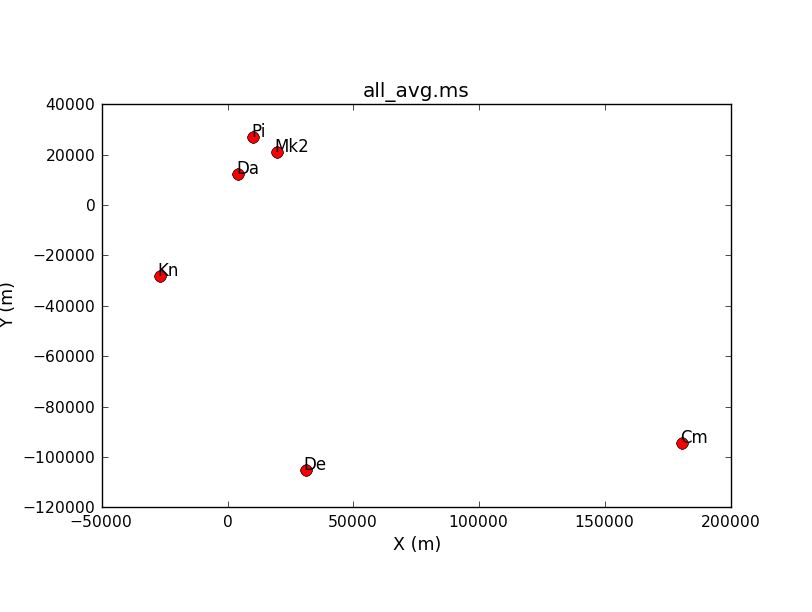

# Part 1: 3C277.1 flagging

##### [<< Return to homepage](../../../index.md)
##### [<< Return to eMERLIN Workshop](../overview_page.md)


3C277.1 is a twin-lobed radio galaxy. These C-band (4-7.3 GHz) e-MERLIN observations were made specifically for this tutorial but previous MERLIN and VLA images have been published by [Ludke et al. 1998](http://adsabs.harvard.edu/abs/1998MNRAS.299..467L) and [Cotton et al. 2006](http://adsabs.harvard.edu/abs/2006A%26A...448..535C).

### <a name="top">Data required and pre-processing</a>
The data have already been converted from `fitsidi` to a Measurement Set (MS), and preparatory steps such as correcting the uv coordinates and averaging have been performed. You need to have:


* [all_avg.ms.tar](http://www.jb.man.ac.uk/~radcliff/DARA/Data_reduction_workshops/3C277_eMERLIN/all_avg.ms.tar) (1.6 G plus another 1.6 G to extract it).
* [3C277.1_flag_skeleton.py](http://www.jb.man.ac.uk/~radcliff/DARA/Data_reduction_workshops/3C277_eMERLIN/3C277.1_flag_skeleton.py): script equivalent of the guide
* [3C277.1_flag_all.py.gz](http://www.jb.man.ac.uk/~radcliff/DARA/Data_reduction_workshops/3C277_eMERLIN/3C277.1_flag_all.py.gz): compressed version for reference if you get stuck
* [all_avg_1.flags](http://www.jb.man.ac.uk/~radcliff/DARA/Data_reduction_workshops/3C277_eMERLIN/all_avg_1.flags): list of flags

1. [Check data: listobs and plotants (step 1)](#check_data)
2. Identify 'late on source' bad data (step 2)
3. Flag the bad data at the start of each scan (step 3)
4. Flag the bad end channels (step 4)
5. Identify and flag remaining bad data (step 5)


The task names are given below. You need to fill in one or more parameters and values where you see \*\*\*. Use the help in CASA, e.g. for `flagdata`

```py
taskhelp                           # list all tasks
inp(flagdata)                      # possible inputs to task
help(flagdata)                     # help for task  
help(par.mode)                     # help for a particular input (only for some parameters)
```

### <a name="check_data">Check data: listobs and plotants (step 1)</a>

* Check that you have `all_avg.ms` in a directory with enough space and start CASA.

* Enter the parameter to specify the MS and, optionally, the parameter to write the listing to a text file.

```py
# in CASA
listobs(***)
```

Because e-MERLIN stores data for each source in a separate `fitsidi` file, the sources are listed one by one even though the phase-ref and target scans interleave. So selected entries from `listobs`, re-ordered by time, show:

```
Timerange (UTC)          Scan  FldId FieldName             nRows   
  SpwIds   Average Interval(s)  #(i.e. RR RL LR LL integration time)
05-May-2015
...
20:02:08.0 - 20:05:08.5     7      0 1302+5748                 2760  
[0,1,2,3]  [3.91, 3.91, 3.91, 3.91]    # phase-ref
20:05:11.0 - 20:12:33.5    72      1 1252+5634                 6660  
[0,1,2,3]  [3.98, 3.98, 3.98, 3.98]    # target
20:12:36.0 - 20:15:34.5     8      0 1302+5748                 2700  
[0,1,2,3]  [3.96, 3.96, 3.96, 3.96]    # phase-ref
...
22:02:04.0 - 22:47:00.5   132      2 1331+305                 40500  [0,
 1, 2, 3]  [3.99, 3.99, 3.99, 3.99] # flux scale/pol angle calibrator
22:47:03.0 - 23:29:59.5   133      3 1407+284                 38700  [0,
 1, 2, 3]  [3.99, 3.99, 3.99, 3.99] # bandpass calibrator
06-May-2015
07:30:03.0 - 08:29:59.5   134      4 0319+415                 54000  [0,
 1, 2, 3]  [4, 4, 4, 4]             # bandpass/leakage calibrator
```

There are 4 spw:

```
SpwID  Name   #Chans   Frame   Ch0(MHz)  ChanWid(kHz)  TotBW(kHz) CtrFreq(MHz)  Corrs          
 0      none      64   TOPO    4817.000      2000.000    128000.0   4880.0000   RR  RL  LR  LL
 1      none      64   TOPO    4945.000      2000.000    128000.0   5008.0000   RR  RL  LR  LL
 2      none      64   TOPO    5073.000      2000.000    128000.0   5136.0000   RR  RL  LR  LL
 3      none      64   TOPO    5201.000      2000.000    128000.0   5264.0000   RR  RL  LR  LL
 ```

 And 6 antennas:

 ```
 ID   Name  Station       Diam.    Long.         Lat.                 ITRF Geocentric coordinates (m)   
  0    Mk2   e-MERLIN:02 24.0 m   -002.18.08.9  +53.02.58.7     3822473.365000  -153692.318000  5085851.303000
  1    Kn    e-MERLIN:05 25.0 m   -002.59.44.9  +52.36.18.4     3859711.503000  -201995.077000  5056134.251000
  2    De    e-MERLIN:06 25.0 m   -002.08.35.0  +51.54.50.9     3923069.171000  -146804.368000  5009320.528000
  3    Pi    e-MERLIN:07 25.0 m   -002.26.38.3  +53.06.16.2     3817176.561000  -162921.179000  5089462.057000
  4    Da    e-MERLIN:08 25.0 m   -002.32.03.3  +52.58.18.5     3828714.513000  -169458.995000  5080647.749000
  5    Cm    e-MERLIN:09 32.0 m   +000.02.19.5  +51.58.50.2     3919982.752000     2651.982000  5013849.826000
  ```

* Enter one parameter to plot the antenna positions (optionally, a second to write this to a png).

```py
plotants(***)
```


